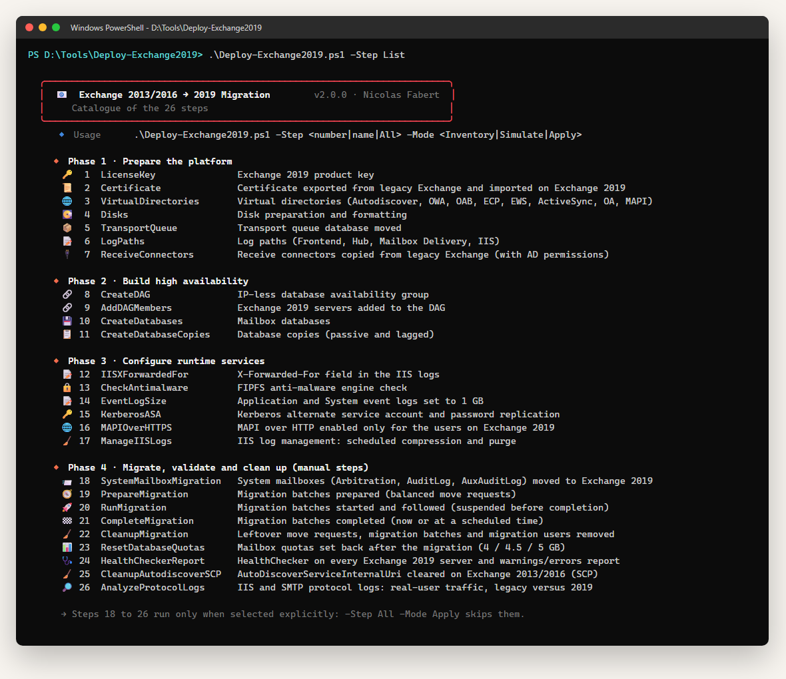

# Exchange 2013/2016 to 2019 Migration — Administrator guide

> Deploys four Exchange 2019 servers next to an existing Exchange 2013/2016 organisation, moves **every mailbox** to them and proves that the legacy servers can be decommissioned — in **26 resumable steps** that can each **inventory, simulate or apply**.

> [!IMPORTANT]
> Files downloaded from the Internet may be blocked by Windows and fail to run. Before using this project, unblock every file in the downloaded folder:
>
> ```powershell
> Get-ChildItem "C:\Chemin\Du\Dossier" -Recurse -File -Force | Unblock-File
> ```
>
> Replace the example path with the folder where you downloaded or extracted this project.

```cards
target | What it does | Prepares the Exchange 2019 servers, builds the DAG and its databases, migrates the system and user mailboxes, then checks that no client still uses the legacy servers.
flow | How it works | One script, `Deploy-Exchange2019.ps1`, runs the steps you select from a catalogue of 26, in **Inventory**, **Simulate** or **Apply** mode.
shield | What it protects | Targets are filtered on **Exchange 2019** (`Version 15.2*`, Edge excluded). Only Steps 15 and 25 touch the legacy servers — and say so in red.
file | What it produces | One **CSV per step**, an HTML **run report**, a run log, one transcript per step, and dedicated HTML reports for the migration and the final checks.
```

## Quick start

```steps
Check the prerequisites | Windows PowerShell **5.1**, the Exchange 2019 Management Shell (local or through WinRM), RSAT `ActiveDirectory`, an **Organization Management** account — chapter 4.
Edit the configuration | `Configs\Deployment.config.psd1`, `Configs\DiskLayout.csv` and `Configs\DAGInfo.csv`: URLs, names, disks, DAG, databases — chapter 6.
List the steps | `.\Deploy-Exchange2019.ps1 -Step List` shows the catalogue of 26 steps.
Take an inventory | `.\Deploy-Exchange2019.ps1 -Step All -Mode Inventory` reads the current state and changes nothing. Read the CSV files and the run report.
Simulate | `.\Deploy-Exchange2019.ps1 -Step (1..9) -Mode Simulate` runs the same actions with `-WhatIf`.
Apply | `-Mode Apply`, phase by phase: steps 1-9, then 10-11, then 12-17 — chapter 8.
Migrate the mailboxes | Steps **18 to 25** are *manual only*: call each one by number, in the order of the runbook — chapter 9.
Validate | `.\Deploy-Exchange2019.ps1 -Step 26 -Mode Inventory` analyses the IIS and SMTP logs: **no legacy traffic** means the old servers can be decommissioned.
```

> [!IMPORTANT]
> **Apply changes production servers.** It asks for a typed confirmation before the first change (`-Force` skips it): always run an Inventory or a Simulate of the same steps first. `-Step All -Mode Apply` never runs the migration steps 18 to 26 — they must be called one by one.

# Part I · Understand

<!-- icon: book -->
## 1. Project background

**Why this project**

- The organisation runs **Exchange 2013** servers, possibly also **Exchange 2016**. All the mailboxes must move to **Exchange Server 2019**.
- **Four Exchange 2019 servers** (`EXCH201901` to `EXCH201904`) are installed **in coexistence** with the legacy servers (`EXCH201601`, `EXCH201602`), on two sites, in one IP-less DAG (`DAG01`).
- **Every mailbox moves**: users, shared mailboxes, rooms, equipment, public folder mailboxes, in-place archives and system mailboxes.
- **The goal is the decommissioning of the legacy servers.** The last step proves, from the IIS and SMTP logs, that no client uses them any more.

**Who this guide is for**

Operators who run the steps, and maintainers who change the code. It assumes Windows PowerShell 5.1 and the Exchange concepts (DAG, move request, virtual directory, certificate, Kerberos ASA), but **no knowledge of the code**: everything else is described here.

| Part | For | When |
|---|---|---|
| I · Understand | Everyone | First reading |
| II · Set up | Operator | Before the first run |
| III · Use | Operator | Before each run, and to read the reports |
| IV · Maintain | Maintainer | Before changing the code |
| Annexes | Everyone | Troubleshooting, filters, IIS logs, releases, glossary |

**Design principles**

```cards
shield | Never touch a legacy server by accident | Every step discovers its targets in Active Directory and keeps only Exchange 2019 servers. A 2013/2016 server named by mistake in a CSV file is reported `Skipped`, never changed.
refresh | Idempotent | Each action checks the target first. When it is already right, the action is reported `AlreadyDone` and not run again: a step can be run as often as needed.
play | Resumable | `Reports\DeploymentState.json` keeps the last status of each step. After an incident, `-Resume` runs again only what is not completed.
chart | Readable | Every action is one row with its value **before** and **after**. Every run has its HTML report; the migration has its own live status page.
```

> [!NOTE]
> A new Exchange 2019 server is picked up automatically by the steps that discover their targets in AD. Only `DiskLayout.csv`, `DAGInfo.csv` and, if used, `DatabaseLayout.Servers` list servers by name.

<!-- icon: flow -->
## 2. How it works

```flow
settings | Configs | Deployment.config.psd1, DiskLayout.csv, DAGInfo.csv
arrow | read by |
terminal | Deploy-Exchange2019.ps1 | the orchestrator, the only script to run
arrow | runs | the selected steps, in order
layers | 26 steps | Steps\StepNN-Name.ps1
arrow | act on | Inventory, Simulate or Apply
database | Exchange organisation | Exchange 2019 servers; legacy servers only in Steps 15 and 25
arrow | write |
chart | Reports | CSV per step, HTML run report, log, transcripts
```

Each step is one file `Steps\StepNN-Name.ps1` holding one function, `Invoke-Step`. The step discovers its targets, then calls `Invoke-Action` once per **atomic action** (one server, one virtual directory, one database...). `Invoke-Action` decides what to do according to the mode, and writes the report row.

### Four phases

| Phase | Steps | Content | Run by `-Step All -Mode Apply` |
|---|---|---|---|
| **1 · System preparation** | 01-07 | Product key, certificate, virtual directories, disks, transport queue, log paths, receive connectors | Yes |
| **2 · DAG and databases** | 08-11 | IP-less DAG, DAG members, mailbox databases, database copies | Yes |
| **3 · Runtime configuration** | 12-17 | IIS X-Forwarded-For, antimalware check, event log size, Kerberos ASA, MAPI over HTTPS, IIS log management | Yes |
| **4 · Migration and validation** | 18-26 | System mailboxes, migration plan, batches, completion, cleanup, quotas, HealthChecker, Autodiscover SCP, protocol-log analysis | **No** — `ManualOnly`, explicit call only |

### Three modes

| Mode | What happens | Changes | Typical status |
|---|---|---|---|
| `Inventory` | Reads the current state of each target. The audit before any action. | **None** | `Inventoried` |
| `Simulate` | Runs the pre-check, then the action with `-WhatIf` (`$WhatIfPreference = $true`). Validates the sequence of planned actions. | **None** | `Simulated`, `AlreadyDone` |
| `Apply` | Runs the pre-check, the action, then reads the target again. Asks for a typed confirmation (unless `-Force`). | **Real** | `Success`, `AlreadyDone`, `Failed` |

The pre-check runs before each action in Simulate and Apply: when the target is already in the expected state, the row is `AlreadyDone` and the action is skipped.

<!-- icon: lightbulb -->
## 3. Things to know

> [!IMPORTANT]
> **Exchange 2019 only.** Every step gets its targets from `Get-Exchange2019Servers`: `AdminDisplayVersion` like `Version 15.2*` **and** a role that is not Edge. Exchange 2013 (`15.0`), Exchange 2016 (`15.1`) and Edge Transport servers are never iterated.

```powershell
# The filter applied by Get-Exchange2019Servers
Get-ExchangeServer | Where-Object {
    $_.AdminDisplayVersion -like 'Version 15.2*' -and $_.ServerRole -notlike '*Edge*'
}
```

> [!CAUTION]
> **Two steps change the legacy servers, on purpose.** **Step 15 · Kerberos ASA** copies the alternate service account credential to **every** Client Access server, 2013/2016 included: Kerberos behind a load balancer needs the same credential everywhere. Its header shows a red warning. **Step 25 · Autodiscover SCP cleanup** clears the SCP of the 2013/2016 servers **only**; the orchestrator shows a dedicated warning before Apply.

> [!WARNING]
> **Steps 18 to 26 are `ManualOnly`.** `-Step All -Mode Apply` skips them and lists them as *manual-only skipped* in the final summary: the migration never starts without an explicit decision. Call them by number (`-Step 20`) or by name (`-Step RunMigration`). In Inventory and Simulate, `-Step All` includes them: they only read.

> [!NOTE]
> **Inventory and Simulate never change Exchange, Active Directory or the servers.** They write files in `Reports\` only — including, for Step 19 in Simulate, the migration plan `MigrationPlan.csv` that Step 20 reads. A Simulate of a step that depends on an earlier one (Step 09 needs the DAG of Step 08, Step 11 the databases of Step 10) can only show a partial plan until the earlier step is applied.

> [!CAUTION]
> **UTF-8 with BOM.** Since 2.0.0 the `.ps1`, `.psm1` and `.psd1` files are plain ASCII: the console icons are built from their code points at run time. Keep them saved as UTF-8 **with BOM** anyway: Windows PowerShell 5.1 reads a file without BOM as Windows-1252, so any accented letter or symbol added later would break the parsing (chapter 12). The tests check both rules.

# Part II · Set up

<!-- icon: checklist -->
## 4. Prerequisites

| Item | Requirement |
|---|---|
| Operating system | Windows Server 2019 or 2022 |
| PowerShell | **Windows PowerShell 5.1** — the version of the Exchange Management Shell. Not PowerShell 7. |
| Exchange | The **Exchange 2019 Management Shell**: local snap-in, or remoting to at least one Exchange 2019 server (`http://<server>/PowerShell/`, Kerberos) |
| Active Directory | RSAT module `ActiveDirectory` (Step 15) |
| Account | Member of **Organization Management**, and **local administrator** on the four Exchange 2019 servers |
| Network | **WinRM 5985/tcp** open to the four Exchange 2019 servers |
| Console | **Windows Terminal** recommended (emoji icons). The classic console works with symbol icons. |
| Browser | Edge, Chrome or Firefox, to open the HTML reports |

### Where to run it

```cards
gear | On an Exchange 2019 server | The simplest case: the snap-in `Microsoft.Exchange.Management.PowerShell.SnapIn` is loaded automatically.
user | On an administration workstation | With the Exchange 2019 management tools installed.
key | From any PowerShell 5.1 | With WinRM access to an Exchange 2019 server: `-ExchangeServer exch201901.contoso.local -Credential (Get-Credential)`.
```

> [!WARNING]
> **Remoting goes further than the Exchange session.** Several steps open their own connection to **each** Exchange 2019 server: disks (Step 04), restart of `MSExchangeIS` (Steps 01, 10, 11), transport queue (05), IIS and log paths (06, 12, 17), event logs (14), log analysis (26). Check that the account has the rights on **every** server, not only on the one used for the Exchange session.

### Rights needed by some steps

| Step | Needs |
|---|---|
| 02 · Certificate | Export rights on the legacy certificate (exportable private key), write access to `CertificateExportPath` |
| 15 · Kerberos ASA | RSAT `ActiveDirectory`; **Create Computer Objects** on the target OU, or an ASA account pre-created by the AD team; `RollAlternateServiceAccountPassword.ps1` from `$env:ExchangeInstallPath\Scripts` — run Step 15 where Exchange 2019 or its management tools are installed |
| 24 · HealthChecker | Local administrator on each Exchange 2019 server |
| 26 · Protocol logs | Read access to the IIS and SMTP log folders of every Exchange server, legacy included |

<!-- icon: download -->
## 5. Installation

```steps
Copy the folder | Copy the package to the server or the workstation, for example `C:\Scripts\Deploy-Exchange2019`.
Unblock the files | `Get-ChildItem C:\Scripts\Deploy-Exchange2019 -Recurse -File -Force | Unblock-File` (files copied from the Internet or a share).
Edit the configuration | `Configs\Deployment.config.psd1`, `DiskLayout.csv`, `DAGInfo.csv` — the environment values are empty in the package (chapter 6).
Check | `.\Deploy-Exchange2019.ps1 -Step List`, then `-Step All -Mode Inventory`.
```

**What is in the folder**

| Path | Content |
|---|---|
| `Deploy-Exchange2019.ps1` | **The only script to run** — the orchestrator |
| `Manage-IISLogs.ps1` | Standalone script: compression and purge of the IIS logs (Annex C), deployed by Step 17 |
| `Modules\Exchange2019.Common.psm1` / `.psd1` | Common module: console and run log, reports, modes, Exchange helpers, resumable state. The manifest holds the version. |
| `Steps\StepNN-Name.ps1` | The 26 steps, one function `Invoke-Step` each |
| `Configs\Deployment.config.psd1` | All the settings |
| `Configs\DiskLayout.csv` · `Configs\DAGInfo.csv` | Disks per server (Step 04) · DAG parameters (Steps 08, 09, 11) |
| `Configs\HealthChecker.ps1` | The **Microsoft** HealthChecker script (Step 24), MIT licence |
| `Docs\` | This guide (Markdown source and HTML) |
| `tools\` · `tests\` | **Repository only**: documentation builder, package builder, automated tests (chapters 12-13, Annex D) |
| `Reports\` | Created at run time (chapter 10) |
| `CHANGELOG.md` · `LICENSE` | Version history · MIT licence |

> [!NOTE]
> **Why HealthChecker is embedded.** `Configs\HealthChecker.ps1` comes from [microsoft/CSS-Exchange](https://github.com/microsoft/CSS-Exchange/tree/main/Diagnostics/HealthChecker). The local copy gives a **reproducible** result (frozen version) and works **offline**, without GitHub during a maintenance window. After a major Cumulative Update, download the new version, check it with `Get-AuthenticodeSignature .\Configs\HealthChecker.ps1` and replace the file.

<!-- icon: settings -->
## 6. Configuration

Everything is set in **`Configs\Deployment.config.psd1`**, a PowerShell data file read with `Import-PowerShellDataFile`: text between quotes, `$true` / `$false`, numbers, `@( )` for lists, `@{ }` for sections, `#` for comments. Two CSV files complete it: `DiskLayout.csv` and `DAGInfo.csv`.

> [!TIP]
> When the file is missing, the orchestrator only warns: the steps that need a key then stop with return code `2` (invalid configuration). A key left with its placeholder (`XXXXX-XXXXX-...`) is treated as missing.

### Names and URLs

| Key | Example | Meaning |
|---|---|---|
| `UrlExterne` | `'mail.contoso.com'` | External host name of the virtual directories (Step 03, fallback) and of Outlook Anywhere |
| `UrlInterne` | `'mail.contoso.com'` | Internal host name, also used for the Autodiscover SCP |
| `DomainNetBios` | `'CONTOSO'` | NetBIOS domain: OWA `DefaultDomain` when `LogonFormat = UserName` |
| `LicenseKey` | `''` | Exchange 2019 product key (Step 01). Empty or `XXXXX-...` stops Step 01 with code `2`, except in Inventory. |

### Certificate (Step 02)

| Key | Default | Meaning |
|---|---|---|
| `CertificateExportPath` | `'D:\sources\exchange2019\exportcert2013a.pfx'` | PFX file. **If it already exists, Step 02 runs in MANUAL mode** and imports it as is; otherwise AUTO mode exports it from a legacy server. |
| `CertificateServices` | `'IIS,POP,SMTP,IMAP'` | Services the legacy certificate must carry, and services enabled on Exchange 2019 |

### Source servers (Steps 03 and 07)

| Key | Default | Meaning |
|---|---|---|
| `SourceServer2016ForConnectors` | `''` | Legacy server whose receive connectors are copied — **first choice** |
| `SourceServer2013ForConnectors` | `'EXCH201601.contoso.local'` | Second choice. Both empty: first Exchange 2016 server found, then first Exchange 2013. |
| `SourceServerForVDirs` | `''` | Model server for URLs and authentication of the virtual directories. Empty: first 2013/2016 non-Edge server found; none: `UrlInterne` / `UrlExterne` and standard Exchange values. |

### Transport queue, domain controllers, legacy key

| Key | Default | Meaning |
|---|---|---|
| `TransportQueueRoot` | `'Q:\Queue'` | New location of the transport queue database (Step 05). The `Q:` volume must exist: Step 04 formats it when `DiskLayout.csv` has a `Queue` row. |
| `PreferredGCs` | `@('dc01.contoso.local','dc02.contoso.local')` | The **first** one is passed as `-DomainController` by Steps 10, 11, 18 and 23, so that objects created in a loop are read back from the same DC. It must be reachable from every Exchange 2019 server. The second one is documentation only: **no automatic fallback**. |
| `MigrationQuotaGB` | `150` | Legacy key, no longer used (the quotas are in `DatabaseLayout.DefaultProperties`). Can be removed. |

### Log paths (Step 06)

| Key | Default | Applied to |
|---|---|---|
| `LogPaths.FrontEndTransportLogs` | `D:\Logs\FrontendTransport` | `Set-FrontendTransportService`: connectivity, receive/send protocol, agent logs |
| `LogPaths.TransportLogs` | `D:\Logs\Transport` | `Set-TransportService`: connectivity, protocol, message tracking, routing table, queue, IRM logs |
| `LogPaths.MailboxDeliveryLogs` | `D:\Logs\MailboxDelivery` | `Set-MailboxTransportService`: delivery agent and pipeline tracing |
| `LogPaths.IISLogsDefaultWebSite` | `D:\Logs\IIS\DefaultWebSite` | IIS site *Default Web Site* |
| `LogPaths.IISLogsBackEnd` | `D:\Logs\IIS\ExchangeBackEnd` | IIS site *Exchange Back End* |
| `LogPaths.Pop3Logs` · `LogPaths.Imap4Logs` | `D:\Logs\Pop3` · `D:\Logs\Imap4` | `Set-PopSettings` / `Set-ImapSettings` |

### Kerberos ASA (Step 15)

| Key | Default | Meaning |
|---|---|---|
| `KerberosASA.AccountName` | `'EXCHASA'` | Computer account of the alternate service account, **without** the final `$` |
| `KerberosASA.Domain` | `'contoso.local'` | DNS domain of the account |
| `KerberosASA.DomainNetBios` | `'CONTOSO'` | Used to build `CONTOSO\EXCHASA$` |
| `KerberosASA.OUPath` | `''` | OU of the account. Empty: `CN=Computers` |
| `KerberosASA.Description` | `'Alternate Service Account credentials for Exchange 2019'` | AD description |
| `KerberosASA.SPNs` | `@('http/mail.contoso.com','http/autodiscover.contoso.com')` | SPNs of the load-balanced names. They must **not** be registered on any other account. |

### Mailbox databases — `DatabaseLayout` (Step 10, read by 04, 11 and 20)

| Key | Default | Meaning |
|---|---|---|
| `Mode` | `'Generator'` | Keep `Generator`. The historical value `Csv` (file `Configs\MailboxDatabases.csv` of version 1.0) is still documented in the file, but Steps 10 and 11 always generate the plan. |
| `DatabasePrefix` · `DatabaseDigits` · `DatabaseStartIndex` · `DatabaseCount` | `'DB'` · `2` · `1` · `4` | Names `DB01` to `DB04` |
| `DriveLetter` | `'M'` | Volume of the databases (`{Drive}` in the templates) |
| `EdbPathTemplate` | `'{Drive}:\Databases\{Name}\{Name}.edb'` | Database file, e.g. `M:\Databases\DB01\DB01.edb` |
| `LogPathTemplate` | `'{Drive}:\Databases\{Name}\Logs'` | Transaction logs, e.g. `M:\Databases\DB01\Logs` |
| `Servers` | `@()` | Servers hosting the active copies, in round-robin. Empty: all the Exchange 2019 servers, in alphabetical order. |
| `DefaultProperties` | see below | Applied by `Set-MailboxDatabase` after creation |

| `DefaultProperties` key | Default | Note |
|---|---|---|
| `ProhibitSendReceiveQuota` · `ProhibitSendQuota` · `IssueWarningQuota` | `150GB` · `149GB` · `148GB` | **Migration quotas**: high on purpose, so that no move is blocked. Step 23 sets the production quotas. |
| `DeletedItemRetention` · `MailboxRetention` | `30.00:00:00` · `90.00:00:00` | Retention of deleted items and deleted mailboxes |
| `EventHistoryRetentionPeriod` · `CalendarLoggingQuota` | `7.00:00:00` · `6GB` | |
| `OfflineAddressBook` | `$null` | Organisation default |
| `IndexEnabled` · `BackgroundDatabaseMaintenance` · `MountAtStartup` | `$true` | |
| `AllowFileRestore` · `RetainDeletedItemsUntilBackup` | `$false` | |
| `IsExcludedFromInitialProvisioning` · `IsExcludedFromProvisioning` · `IsSuspendedFromProvisioning` · `AutoDagExcludeFromMonitoring` | `$false` | New mailboxes can be created on these databases |

### Migration (Steps 19 to 21)

| Key | Default | Meaning |
|---|---|---|
| `Migration.BatchCount` | `12` | Number of batches built by Step 19 |
| `Migration.BadItemLimit` | `20` | Passed to each migration batch |
| `Migration.LargeItemLimit` | `0` | Passed to each migration batch |
| `Migration.AcceptLargeDataLoss` | `$false` | Passed only when `$true` (switch parameter) |

### DAG and copies (Steps 08 and 11)

| Key | Default | Meaning |
|---|---|---|
| `DAG.DACMode` | `'DagOnly'` | Datacenter Activation Coordination — **mandatory** for an IP-less DAG |
| `DAG.NetworkEncryption` · `DAG.NetworkCompression` | `'Enabled'` | Replication traffic |
| `DAG.SafetyNetHoldTime` | `8` (days) | Must be **greater than or equal to** `ReplayLagTime` |
| `DatabaseCopies.ReplayLagTime` | `7.00:00:00` | Lag of the lagged copy (preference 4) |
| `DatabaseCopies.TruncationLagTime` | `0.00:00:00` | |
| `DatabaseCopies.ReplayLagMaxDelay` | `1.00:00:00` | Set on the lagged copy with `Set-MailboxDatabaseCopy` |

### Checks and maintenance (Steps 13, 14, 17, 23, 24)

| Key | Default | Meaning |
|---|---|---|
| `Antimalware.EventLogName` · `EventSource` | `'Application'` · `'Microsoft-Filtering-FIPFS'` | Where Step 13 reads |
| `Antimalware.UpdateOK_EventID` · `UpdateKO_EventID` | `6033` · `6027` | Update succeeded · update attempted |
| `Antimalware.SearchHours` | `24` | Window read |
| `EventLogs.TargetSizeBytes` · `EventLogs.Logs` | `1GB` · `@('Application','System')` | Step 14 |
| `IISLogsManagement.LogPath` | `'D:\Logs\IIS'` | Fallback root of the IIS logs (parent of both IIS paths of `LogPaths`); the real root is detected at run time |
| `IISLogsManagement.ScheduledTaskName` | `'Manage IIS Logs - Exchange'` | Task created by Step 17 |
| `IISLogsManagement.ScriptDeployPath` | `'C:\Scripts\Manage-IISLogs.ps1'` | Where the script is copied on each server |
| `IISLogsManagement.RunDay` · `RunTime` | `'Sunday'` · `'02:00'` | Weekly schedule |
| `IISLogsManagement.RetainUncompressedDays` · `PurgeAfterDays` | `7` · `180` | Compression after 7 days, purge of the archives after 6 months |
| `PostMigrationQuotas.IssueWarningQuota` · `ProhibitSendQuota` · `ProhibitSendReceiveQuota` | `4GB` · `4608MB` · `5GB` | Production quotas set by Step 23 |
| `HealthCheckerReport.ScriptPath` | `'Configs\HealthChecker.ps1'` | Relative to the framework folder |
| `HealthCheckerReport.SkipVersionCheck` | `$true` | No version check on GitHub (servers without Internet) |
| `HealthCheckerReport.BuildOfficialHtml` | `$true` | Also builds the official HealthChecker HTML |

### Protocol-log analysis — `LogAnalysis` (Step 26)

| Key | Default | Meaning |
|---|---|---|
| `DefaultHoursWindow` | `24` | Rolling window in hours. Overridden by the environment variable `LOG_HOURS`. |
| `IISVdirsToTrack` | `Mapi, OWA, EWS, OAB, ECP, RPC, Autodiscover, Microsoft-Server-ActiveSync, PowerShell` | Matched on the first segment of the URI, case-insensitive. Everything else is counted in `<Other>`. |
| `SmtpAutoEnableProtocolLogs` | `$true` | In Apply, sets `ProtocolLoggingLevel = Verbose` on the connectors where it is `None` |
| `IISExcludeUriPatterns` | `'/healthcheck\.htm$'` | Regex on `cs-uri-stem` |
| `IISRequireAuthenticatedUser` | `$true` | Requests without an authenticated identity are not counted |
| `IISExcludeUserPatterns` | 14 patterns | Regex on `cs-username`: the full value, the part after `DOMAIN\` and the part before `@` are tested — Annex B |
| `IISExcludeUserAgentPatterns` | 13 patterns | Case-insensitive substrings of `cs(User-Agent)` — Annex B |
| `IISRequireSuccessStatus` | `$true` | Only `2xx` responses are counted |
| `SmtpRequireMailFromForValid` | `$true` | A session counts only if it sent a `MAIL FROM` |
| `SmtpRequireSenderAddress` | `$true` | The sender must be a non-empty, non-system address |
| `SmtpExcludeSenderPatterns` | 10 patterns | Regex on the `MAIL FROM` address — Annex B |

> [!WARNING]
> **Keep the strict filters (`$true`).** Without them, health probes and NTLM/Negotiate challenges are counted as user traffic, and the legacy servers never look idle. Annex B explains every rule.

### `Configs\DiskLayout.csv` (Step 04)

Separator `;`, one row per volume and per server.

| Column | Meaning |
|---|---|
| `ServerName` | Exchange 2019 server (case-insensitive). A server absent from the file is `Skipped`. |
| `Role` | `Swap`, `Queue` or `Databases` — decides the file system and the cluster size |
| `DriveLetter` | Letter without `:` (`X`, `Q`, `M`) |
| `DiskNumber` | Physical disk number. **When filled in, it wins** over the size range. |
| `MinSizeGB` · `MaxSizeGB` | Size range used to find the disk when `DiskNumber` is empty (`99999` = no maximum). A disk outside the range is refused. |

```text
ServerName;Role;DriveLetter;DiskNumber;MinSizeGB;MaxSizeGB
EXCH201901;Queue;Q;3;90;200
EXCH201901;Databases;M;4;200;99999
EXCH201901;Swap;X;;20;90
```

### `Configs\DAGInfo.csv` (Steps 08, 09, 11)

Separator `,`, **one row** (one DAG).

| Column | Example | Meaning |
|---|---|---|
| `DAGName` | `DAG01` | DAG name |
| `DAGIps` | `255.255.255.255` | **IP-less** DAG (passed as `[IPAddress]::None`) |
| `WitnessServer` · `WitnessDir` | `DC01.contoso.local` · `C:\DAG01-FSW` | File share witness |
| `AltWitnessServer` · `AltWitnessDir` | | Alternate witness |
| `Site1Servers` · `Site2Servers` | `EXCH201901,EXCH201902` · `EXCH201903,EXCH201904` | Members per site, separated by commas (quote the field) |
| `GC` | `dc02.contoso.local` | Domain controller passed as `-DomainController` when Step 08 creates the DAG |
| `MaximumActiveDatabasesSite1` · `MaximumPreferredActiveDatabasesSite1` | `2` · empty | Limits of the site 1 servers (empty or `0` = not set) |
| `MaximumActiveDatabasesSite2` · `MaximumPreferredActiveDatabasesSite2` | `2` · `0` | Limits of the site 2 servers |
| `ManualDagnetworkConfiguration` | `False` | `True` to manage the DAG networks by hand |
| `ReplayLagManagerEnabled` | `True` | Lagged copies replay automatically when needed |
| `ReplicationPort` | `64327` | Replication TCP port |
| `AutoDatabaseMountDial` | `BestAvailability` | Set on each member |

### Files produced and read by the migration steps

| File | Written by | Read by | Content |
|---|---|---|---|
| `Reports\MigrationPlan.csv` | Step 19 (Simulate, Apply) | Step 20 (Simulate, Apply, Follow) | One row per mailbox and per archive, with its batch |
| `Reports\MigrationBatchStatus.csv` | Step 21 | You | State of the batches after a completion |

`MigrationPlan.csv` — separator `;`, UTF-8:

| Column | Meaning |
|---|---|
| `DisplayName` | Display name; archives get the suffix ` (Archive)` |
| `PrimarySmtpAddress` · `Alias` | Primary address · AD alias |
| `RecipientTypeDetails` | `UserMailbox`, `SharedMailbox`, `RoomMailbox`, `EquipmentMailbox`, `PublicFolderMailbox`, or `Archive` |
| `SourceServer` · `SourceDatabase` | Legacy server and database |
| `HasArchive` | `True` when the mailbox has an in-place archive |
| `SizeMB` | Size from `Get-MailboxStatistics` |
| `Type` | `Primary` or `Archive` |
| `Batch` | Batch number, 1 to `BatchCount` |

```text
DisplayName;PrimarySmtpAddress;Alias;RecipientTypeDetails;SourceServer;SourceDatabase;HasArchive;SizeMB;Type;Batch
John Smith;john.smith@contoso.com;jsmith;UserMailbox;EXCH201601;DB-LEG-01;True;4123,45;Primary;3
John Smith (Archive);john.smith@contoso.com;jsmith;Archive;EXCH201601;DB-ARCH-01;True;8741,12;Archive;3
Accounting;accounting@contoso.com;accounting;SharedMailbox;EXCH201602;DB-LEG-02;False;5230,00;Primary;5
PF Mailbox 1;pf1@contoso.com;pf1;PublicFolderMailbox;EXCH201602;DB-PF-01;False;980,57;Primary;1
```

> [!NOTE]
> `SizeMB` uses the decimal separator of the culture of the session (`,` with French regional settings). PowerShell reads it back correctly; take care if another tool reads the file.

> [!TIP]
> To move a mailbox to another batch, change its `Batch` value **before** Step 20 — and keep the primary and the archive of a mailbox in the same batch. Running Step 19 again in Simulate or Apply overwrites the file.

# Part III · Use

<!-- icon: terminal -->
## 7. Everyday use

Open **Windows PowerShell 5.1** as administrator — preferably in Windows Terminal — on an Exchange 2019 server or on the admin workstation. Go to the framework folder and run one command.

| I want… | Command |
|---|---|
| See the 26 steps | `.\Deploy-Exchange2019.ps1 -Step List` |
| Read the state of everything | `.\Deploy-Exchange2019.ps1 -Step All -Mode Inventory` |
| Preview the preparation | `.\Deploy-Exchange2019.ps1 -Step (1..9) -Mode Simulate` |
| Apply one step | `.\Deploy-Exchange2019.ps1 -Step 3 -Mode Apply` |
| Apply several steps | `.\Deploy-Exchange2019.ps1 -Step 10,11 -Mode Apply` |
| Run a step by its name | `.\Deploy-Exchange2019.ps1 -Step PrepareMigration -Mode Simulate` |
| Apply phases 1 to 3 at once | `.\Deploy-Exchange2019.ps1 -Step All -Mode Apply` (steps 18-26 are skipped) |
| Continue after an incident | `.\Deploy-Exchange2019.ps1 -Step All -Mode Apply -Resume` |
| Work from an admin workstation | add `-ExchangeServer exch201901.contoso.local -Credential (Get-Credential)` |
| Read the full help | `Get-Help .\Deploy-Exchange2019.ps1 -Full` |

> [!NOTE]
> `-Step` takes a number, a list or range (`1,2,3`, `(1..9)`), a name from chapter 8, `All` or `List` (shows the catalogue and exits). Write the numbers without a leading zero: `-Step 3`, not `-Step 03`. An unknown number or name stops the run with exit code `11`.

### Mode, resume and confirmation

`-Mode` is `Inventory` (default), `Simulate` or `Apply` — chapter 2. Apply asks for a typed confirmation first, with a special warning when Step 25 is selected.

| Parameter | Effect |
|---|---|
| `-Resume` | Reads `Reports\DeploymentState.json` and keeps only the steps with no state or in state `Pending`, `Failed` or `InProgress`. Combined with an explicit `-Step` list, only the steps of the list are kept |
| `-Force` | Skips the typed confirmation of Apply. Use it for the explicit calls of the migration steps, never "just in case" |

### Connection and folders

| Parameter | Default | Use |
|---|---|---|
| `-ExchangeServer` | `$env:COMPUTERNAME` | Exchange 2019 server used for remote PowerShell when the shell is not loaded locally |
| `-Credential` | current account | Account for remote PowerShell and remoting (Organization Management) |
| `-OutputFolder` | `.\Reports` | Root of the reports, of the state file and of the plans |
| `-CsvFolder` | `.\Configs` | Folder of `DiskLayout.csv` and `DAGInfo.csv` |
| `-ConfigFile` | `.\Configs\Deployment.config.psd1` | Configuration file; another file per environment is possible |

### Step-specific parameters

These parameters only make sense with one step. The orchestrator refuses them when the step is not selected.

| Parameter | Step | Use | Without the step |
|---|---|---|---|
| `-PfxPassword` *(SecureString)* | 2 | Password of the PFX. Without it, Apply prompts for it | exit `12` |
| `-RemoteDiskFormat` | 4 | Disk preparation driven from an admin workstation. Step 04 always works through remoting on every server of `DiskLayout.csv` | — |
| `-Follow` | 20 | Follow mode: nothing is submitted, the status report is regenerated | exit `13` |
| `-FollowInterval` *(minutes)* | 20 | Refresh interval, default `60`; `0` = one report then exit | exit `13` |
| `-BatchNumber` | 21 | `'01'`, `'06','07','08'` or `ALL`; digits become `Batch01`, `Batch06`… | — |
| `-ScheduledCompletionTime` | 21 | `'2026-06-15 23:00'`, or `'23:00'` for today; a time in the past means "now" | — |
| `-FollowAfter` | 21 | After the completion order, chains Step 20 in Follow mode, focused on the batches of `-BatchNumber` | exit `14` |

The PFX password, with or without Posh-ACME:

```powershell
# Certificate renewed with Posh-ACME 4.x: PfxPass is already a SecureString
$cert = Get-PACertificate
.\Deploy-Exchange2019.ps1 -Step 2 -Mode Apply -PfxPassword $cert.PfxPass -Force

# Any other PFX
.\Deploy-Exchange2019.ps1 -Step 2 -Mode Apply -PfxPassword (Read-Host 'PFX password' -AsSecureString)
```

> [!CAUTION]
> Do not pass `$cert.PfxPass` through `ConvertTo-SecureString`: it is already a SecureString, and the conversion produces the literal text `System.Security.SecureString` as the password.

### Environment variables

| Variable | Read by | Effect |
|---|---|---|
| `LOG_HOURS` | Step 26 | Analysis window in hours (e.g. `168` = 7 days); overrides `LogAnalysis.DefaultHoursWindow` |
| `FOLLOW` | Step 20 | `1`, `true` or `yes` = Follow mode, like `-Follow` |
| `FOLLOW_INTERVAL` | Step 20 | Refresh interval in minutes; **overrides** `-FollowInterval` |
| `CLEANUP_INCLUDE_FAILED` | Step 22 | `1` also removes the failed batches and move requests |
| `BATCH` · `SCHEDULE_TIME` | Step 21 | Older equivalents of `-BatchNumber` and `-ScheduledCompletionTime`; they **take precedence** over the parameters |
| `EXM_ICONS` | console | `Emoji`, `Symbols` or `Ascii` |
| `NO_COLOR` | console | Any value disables the colours |

> [!WARNING]
> An environment variable lives as long as the PowerShell window. A forgotten `$env:BATCH` or `$env:FOLLOW_INTERVAL` silently wins over the parameters of the next run. Clean up after use:
>
> `Remove-Item Env:BATCH, Env:SCHEDULE_TIME, Env:FOLLOW, Env:FOLLOW_INTERVAL, Env:CLEANUP_INCLUDE_FAILED, Env:LOG_HOURS -ErrorAction SilentlyContinue`

### What you see



`-Step List` prints the 26 steps — number, name and title, phase by phase — then a usage line. Nothing else runs.


```cards
info | Title card | A framed card **Exchange 2013/2016 → 2019 Migration   v2.0.0 · Nicolas Fabert**, subtitle *Deployment, mailbox migration and validation*, then the rows Mode, Steps (the selection), Server (remoting target), Config, Reports (the run folder) and Log.
layers | Step header | One numbered pill per step of the selection (`2/5`) with its icon and title — *Step 03 · Virtual directories* — then the planned actions and the scope line: *Exchange 2019 only*, or a warning when legacy servers are also changed.
checklist | Result lines | One line per target: status icon, status, target, action and detail. The current value is shown on a dimmed second line.
chart | Step summary | The count per status and the path of the CSV file of the step.
target | Final card | **Run complete** (green), **Run complete, some actions failed** (yellow) or **Run finished with errors** (red): steps OK, failed and manual-only skipped, mode, duration, run report HTML, reports folder and log.
```

| Console status | Report status | Meaning |
|---|---|---|
| `OK` | `Success` | Change applied and checked |
| `DONE` | `AlreadyDone` | Already compliant, nothing to do |
| `INV` | `Inventoried` | Current state read |
| `SIM` | `Simulated` | Change previewed, not applied |
| `SKIP` | `Skipped` | Nothing to do or not applicable (e.g. server missing from a CSV) |
| `FAILED` | `Failed` | Error — the message is in the `ErrorMessage` column |

Icons are emoji in Windows Terminal, symbols of the console fonts in the classic console (conhost), and plain ASCII when forced with `EXM_ICONS` (e.g. `Ascii` for a remote session that shows square boxes); `NO_COLOR` gives plain text. Colours are console colours, not escape sequences, so the transcripts stay clean.

Each run also writes `Reports\<run>\Deploy-Exchange2019.log` — timestamps and levels, no colours, no icons — and one transcript per step, `Transcript_StepNN-Name.log`, in the same run folder.

### Exit codes

| Code | Meaning |
|---|---|
| `0` | All selected steps completed — also returned when the operator declines the Apply confirmation |
| `1` | At least one step failed |
| `2` | Every step completed, but some actions failed: the final card is yellow, *Run complete, some actions failed* — open the run report |
| `10` | Module `Modules\Exchange2019.Common.psd1` missing |
| `11` | Unknown step number or name |
| `12` | `-PfxPassword` without step 2 |
| `13` | `-Follow` or `-FollowInterval` without step 20 (allowed with `-FollowAfter` and step 21) |
| `14` | `-FollowAfter` without step 21 |

> [!TIP]
> **Interrupted?** <kbd>Ctrl</kbd>+<kbd>C</kbd> stops the run; the step in progress stays `InProgress` in `DeploymentState.json`. Every action is idempotent: run the same command again, or add `-Resume`. In Step 20 Follow mode, <kbd>Ctrl</kbd>+<kbd>C</kbd> is the normal way out — the migration itself continues on the servers.

> [!WARNING]
> Several steps restart services or need a reboot: Step 01 (`MSExchangeIS`), Step 03 (IIS reset, one server at a time), Step 04 (page file — **reboot required**), Steps 05 and 06 (transport services), Steps 10 and 11 (`MSExchangeIS`). Run them in a maintenance window, before the 2019 servers carry users.

<!-- icon: layers -->
## 8. The 26 steps

| # | Name (for `-Step`) | What it does | Legacy changed |
|---|---|---|---|
| 01 | `LicenseKey` | Product key + Information Store restart | — |
| 02 | `Certificate` | Copies the public certificate from legacy to 2019 | — (export only) |
| 03 | `VirtualDirectories` | URLs, authentication, Extended Protection, SCP | — |
| 04 | `Disks` | Volumes, database folders, page file | — |
| 05 | `TransportQueue` | Moves the transport queue database | — |
| 06 | `LogPaths` | Transport, IIS, POP3/IMAP4 log paths | — |
| 07 | `ReceiveConnectors` | Copies the custom receive connectors | — |
| 08 | `CreateDAG` | IP-less DAG | — |
| 09 | `AddDAGMembers` | DAG members, activation limits, DAC mode | — |
| 10 | `CreateDatabases` | Generated databases, cleanup of the default ones | — |
| 11 | `CreateDatabaseCopies` | Passive and lagged copies, rebalancing | — |
| 12 | `IISXForwardedFor` | `X-Forwarded-For` in the IIS logs | — |
| 13 | `CheckAntimalware` | Anti-malware update check (read only) | — |
| 14 | `EventLogSize` | Application and System log sizes | — |
| 15 | `KerberosASA` | Kerberos alternate service account | **Yes** |
| 16 | `MAPIOverHTTPS` | MAPI over HTTP for the 2019 mailboxes | — |
| 17 | `ManageIISLogs` | Weekly IIS log compression and purge | — |
| 18 | `SystemMailboxMigration` | Moves the system mailboxes | Source of the moves |
| 19 | `PrepareMigration` | Builds the balanced batch plan | — |
| 20 | `RunMigration` | Creates the batches, follows the migration | Source of the moves |
| 21 | `CompleteMigration` | Completes the batches, now or at a set time | Source of the moves |
| 22 | `CleanupMigration` | Removes finished batches and move requests | — |
| 23 | `ResetDatabaseQuotas` | Production quotas on the 2019 databases | — |
| 24 | `HealthCheckerReport` | HealthChecker on every 2019 server | — |
| 25 | `CleanupAutodiscoverSCP` | Empties the SCP of the legacy servers | **Yes** |
| 26 | `AnalyzeProtocolLogs` | Remaining legacy traffic, IIS and SMTP | — (Apply: logging level) |

Each step below is described the same way: targets, behaviour per mode, configuration read, files written, return codes. In every mode, a step returns `0` when it ran to the end — the individual results are in its CSV. `1` means a missing precondition, `2` an invalid configuration.

### Phase 1 · System preparation — Steps 01 to 07

#### Step 01 · Product key — `LicenseKey`

| Item | Detail |
|---|---|
| Targets | Exchange 2019 servers |
| Inventory | Edition and trial state of each server |
| Simulate · Apply | Pre-check: `IsExchangeTrialEdition` is `$false` → `DONE`. Otherwise `Set-ExchangeServer -ProductKey`, then restart of `MSExchangeIS` through `Get-Service -ComputerName` (Restart, or Start if stopped) |
| Reads | `LicenseKey` |
| Return codes | `2` key empty or still the placeholder (outside Inventory) · `1` no Exchange 2019 server found |

#### Step 02 · Certificate — `Certificate`

| Item | Detail |
|---|---|
| Targets | Legacy Mailbox servers (read and export only) and Exchange 2019 servers (import) |
| MANUAL mode | `CertificateExportPath` points to an **existing PFX**: the step opens it, checks the private key, reads the thumbprint and **skips** discovery and export. Use it when the key is not exportable on the legacy server, or when the certificate was renewed elsewhere (Posh-ACME) |
| AUTO mode | No PFX yet: the step walks through the legacy 2013/2016 Mailbox servers (non-Edge), keeps the certificates that are **not self-signed** and carry **all** the services of `CertificateServices`, picks the one that expires last and exports it with `Export-ExchangeCertificate` |
| Apply | On each 2019 server: `Import-ExchangeCertificate -PrivateKeyExportable $true`, then `Enable-ExchangeCertificate -Services IIS,POP,SMTP,IMAP`. Pre-check by thumbprint: an imported and enabled certificate is `DONE` |
| Password | `-PfxPassword`, otherwise prompted in Apply. Apply in a non-interactive session without `-PfxPassword` fails. Inventory and Simulate without a password cannot open the PFX, so they cannot validate it |
| Return codes | `2` configuration missing · `3` no suitable certificate on the legacy servers · `4` the PFX cannot be opened or has no private key |

> [!NOTE]
> Through remote PowerShell, `Get-ExchangeCertificate` returns `Services` and `IsSelfSigned` empty (double serialization). The step reads them with a helper that evaluates the properties inside the Exchange session, so the AUTO filter works from a workstation too.

#### Step 03 · Virtual directories — `VirtualDirectories`

| Item | Detail |
|---|---|
| Targets | Exchange 2019 servers. **Nothing is changed on the legacy servers** |
| Source | URLs and authentication are copied from a legacy model server: `SourceServerForVDirs`, else the first 2013/2016 non-Edge server found, else `UrlInterne` / `UrlExterne` and standard Exchange values |
| Inventory | Current URLs, authentication and Extended Protection of every virtual directory |
| Simulate · Apply | One action per virtual directory, skipped (`DONE`) when URL, authentication and Extended Protection already match. Then an **IIS reset, one server at a time**, so that clients always have a server |

| Object | Settings |
|---|---|
| SCP | `AutoDiscoverServiceInternalUri`: the value of the model server, else `https://mail.contoso.com/Autodiscover/Autodiscover.xml` (built from `UrlInterne`) |
| OWA · ECP | `/OWA` and `/ECP` URLs, forms authentication, `LogonFormat`; `DefaultDomain` = `DomainNetBios` when the logon format is `UserName` and the source has none |
| Autodiscover | `/Autodiscover` URL, Basic, Windows and WS-Security authentication |
| OAB · EWS | `/OAB` and `/EWS/Exchange.asmx` URLs; EWS also gets OAuth |
| ActiveSync | `/Microsoft-Server-ActiveSync` URLs and authentication |
| Outlook Anywhere | Internal and external host names; external `Negotiate`, internal `NTLM` (Step 15 switches it to `Negotiate`); IIS `Basic, NTLM, Negotiate`; SSL offloading **off** |
| MAPI | `/mapi` URLs; IIS `NTLM, OAuth, Negotiate` |
| Extended Protection | OWA, ECP, MAPI, Outlook Anywhere: `Require` · EWS, OAB, ActiveSync: `Allow` · Autodiscover: `None` |

#### Step 04 · Disks — `Disks`

| Item | Detail |
|---|---|
| Targets | Each Exchange 2019 server listed in `DiskLayout.csv`, through `Invoke-Command`. A 2019 server absent from the file is `SKIP`; an empty file gives a warning and return code `0` |
| Disk selection | `DiskNumber` when set, otherwise the disk whose size is within `MinSizeGB`–`MaxSizeGB`. Disks holding `C:` and `D:` are always excluded. Drive letters only, no mount points |
| Volumes | `Swap` → `X:` NTFS 4 KB (skipped if already NTFS) · `Queue` → `Q:` NTFS 64 KB · `Databases` → `M:` **ReFS 64 KB**, integrity streams off. Raw disks are initialised in GPT, then partitioned with the maximum size |
| Database folders | For each name generated by `DatabaseLayout` (`DB01`…), creates `M:\Databases\<DB>\Logs`. Step 10 then never fails with *The path doesn't exist* on a fresh volume |
| Page file | Automatic management off, a single `X:\pagefile.sys` with initial = maximum = **25 % of the RAM**, other page files removed. **Reboot required**; the next Inventory shows `REBOOT PENDING` until then |
| Apply prompt | In an interactive Apply, the step asks whether the disks are already initialised and formatted. Answering yes twice skips initialisation, partitioning and formatting — the folders are still created. No prompt in Inventory, Simulate or a non-interactive session |
| Reads | `DiskLayout.csv`, `DatabaseLayout` |

#### Step 05 · Transport queue — `TransportQueue`

| Item | Detail |
|---|---|
| Targets | Exchange 2019 servers |
| Inventory | Current `QueueDatabasePath` and `QueueDatabaseLoggingPath` |
| Simulate · Apply | Already on `TransportQueueRoot` → `DONE`. Otherwise runs Microsoft's `Move-TransportDatabase.ps1` (from `$env:ExchangeInstallPath\Scripts`, on the server) through remoting, then restarts `MSExchangeTransport` and `MSExchangeFrontEndTransport` |
| Reads | `TransportQueueRoot` (the `Q:` volume of Step 04) |

#### Step 06 · Log paths — `LogPaths`

| Item | Detail |
|---|---|
| Targets | Exchange 2019 servers |
| Changes | Front End transport: connectivity, receive and send protocol, agent logs · Transport (hub): connectivity, protocol, message tracking, routing table, queue, IRM logs · Mailbox delivery: delivery agent, pipeline tracing · IIS: *Default Web Site* and *Exchange Back End* through `WebAdministration` (`system.applicationHost/sites`) · POP3 and IMAP4 |
| Apply | Only the paths that differ are changed; the affected services are restarted afterwards |
| Reads | `LogPaths` |

#### Step 07 · Receive connectors — `ReceiveConnectors`

| Item | Detail |
|---|---|
| Source | `SourceServer2016ForConnectors`, else `SourceServer2013ForConnectors`, else the first Exchange 2016 server found, else the first Exchange 2013. **The source is never modified** |
| Targets | Exchange 2019 servers |
| Simulate · Apply | For each custom (non-default) connector of the source, with all its parameters: created on each 2019 server when missing, otherwise compared and updated with `Set-ReceiveConnector` |
| Permissions | The non-inherited AD permissions of each connector (e.g. anonymous relay) are replicated on the copy, addressed by `DistinguishedName` |

### Phase 2 · High availability — Steps 08 to 11

#### Step 08 · Create the DAG — `CreateDAG`

| Item | Detail |
|---|---|
| Reads | `DAGInfo.csv` (one row) and `Config.DAG` |
| Simulate · Apply | When missing: `New-DatabaseAvailabilityGroup` **IP-less** (`[IPAddress]::None`) with the witness server and folder, on the `GC` domain controller. Then `Set-DatabaseAvailabilityGroup`: alternate witness, network encryption and compression, replication port, replay lag manager, manual network configuration |
| Safety Net | `Set-TransportConfig -SafetyNetHoldTime` (organisation-wide) when the current value is below `DAG.SafetyNetHoldTime` |
| DAC mode | Exchange refuses `DatacenterActivationMode` on a DAG with fewer than two members: the step postpones it to Step 09 |
| Not done here | No member is added |

#### Step 09 · DAG members — `AddDAGMembers`

| Item | Detail |
|---|---|
| Preconditions | The DAG exists (otherwise error: run Step 08 again) and each server of `Site1Servers` / `Site2Servers` is an Exchange 2019 server |
| Simulate · Apply | `Add-DatabaseAvailabilityGroupServer` unless already a member; `Set-MailboxServer` with `MaximumActiveDatabases`, `MaximumPreferredActiveDatabases` (when not `0`) and `AutoDatabaseMountDial` of the site |
| DAC mode | Once two members or more are in: `Set-DatabaseAvailabilityGroup -DatacenterActivationMode` = `DAG.DACMode` |

#### Step 10 · Databases — `CreateDatabases`

| Item | Detail |
|---|---|
| Plan | Names and paths generated from `DatabaseLayout`; active servers in round-robin. Written to `Reports\DatabasePlan.csv` |
| Simulate · Apply | For each database: EDB and log folders created **on the target server**; `New-MailboxDatabase -DomainController <PreferredGCs[0]>`; `Set-MailboxDatabase` with every key of `DefaultProperties`; `Mount-Database` with up to **5 attempts, 60 s apart** |
| Default databases | The `Mailbox Database NNNNNNNNNN` databases created by the installation, on **2019 servers only**: their health mailboxes are removed with `Remove-Mailbox -Monitoring`. If user, arbitration or audit mailboxes remain → warning and a YES/NO prompt. An empty database is dismounted, removed, and its EDB and log files deleted |
| Apply | Restart of `MSExchangeIS` on each target, so that the databases are taken into account |

> [!NOTE]
> Why `Remove-Mailbox -Monitoring` and not `Disable-Mailbox`: `Disable-Mailbox` detaches the mailbox but leaves an orphan AD object in *Microsoft Exchange System Objects*; `Remove-Mailbox -Monitoring` removes both. The Exchange Health Manager re-creates the health mailboxes on a valid database at its next start — monitoring is not broken.

#### Step 11 · Database copies — `CreateDatabaseCopies`

The copy plan is computed, not read from a file, and written to `Reports\CopyPlan.csv`.

| Preference | Role | Server |
|---|---|---|
| 1 | Active | Server of the database in the round-robin |
| 2 | Passive | Same site, next server |
| 3 | Passive | Other site, same index |
| 4 | **Lagged** | Other site, next index — `ReplayLagTime` and `TruncationLagTime` of `DatabaseCopies` |

With four servers on two sites, each server ends up with one active, two passive and one lagged copy.

| Item | Detail |
|---|---|
| Simulate · Apply | `Add-MailboxDatabaseCopy -DomainController <PreferredGCs[0]>` for each missing copy; `Set-MailboxDatabaseCopy -ReplayLagMaxDelay` on the lagged copy |
| Apply | Restart of `MSExchangeIS`; wait until every copy is `Healthy` or `Mounted` (10 min timeout); rebalancing with `Move-ActiveMailboxDatabase -ActivatePreferredOnServer` |

### Phase 3 · Runtime configuration — Steps 12 to 17

#### Step 12 · X-Forwarded-For — `IISXForwardedFor`

Adds the custom field `X-Forwarded-For` (source: request header) to the IIS logs of *Default Web Site* and *Exchange Back End* on each 2019 server, so that the real client IP is visible behind the load balancer. Already present → `DONE`.

#### Step 13 · Anti-malware check — `CheckAntimalware`

Read only, in every mode. Searches the Application log of each 2019 server for the last `SearchHours` hours:

| Events found | Result |
|---|---|
| `6033` (with or without `6027`) | OK — updates work |
| `6027` without `6033` | **Warning** — updates are attempted but fail: proxy or firewall |
| Neither | **Warning** — the filtering engine (FIPFS) looks inactive |

#### Step 14 · Event log size — `EventLogSize`

| Item | Detail |
|---|---|
| Targets | `EventLogs.Logs` (Application, System) on each 2019 server |
| Inventory | Current `MaximumKilobytes` (`Get-EventLog -List`) |
| Simulate · Apply | Equal to `TargetSizeBytes` → `DONE`; otherwise `Limit-EventLog -MaximumSize` (bigger **or** smaller) |
| GPO | When `HKLM\Software\Policies\Microsoft\Windows\EventLog\<Log>\MaxSize` exists, a GPO controls the size: warning, no change |

#### Step 15 · Kerberos ASA — `KerberosASA`

Implements the Microsoft procedure [Configure Kerberos authentication for load-balanced Client Access services](https://learn.microsoft.com/en-us/exchange/architecture/client-access/kerberos-auth-for-load-balanced-client-access). The step banner shows a red warning: **legacy servers are changed too**.

```steps
Create the account | `New-ADComputer` with a strong random password, in `OUPath` or `CN=Computers`. An account created beforehand is `DONE`.
Enable AES | `msDS-SupportedEncryptionTypes` = `28` (RC4 + AES128 + AES256).
First server | `RollAlternateServiceAccountPassword.ps1 -ToSpecificServer <first 2019 FQDN> -GenerateNewPasswordFor CONTOSO\EXCHASA$`.
Other servers | Same script with `-CopyFrom`, to the other 2019 servers **and** the legacy non-Edge servers.
Check the SPNs | `setspn -F -Q` for each SPN: it must not belong to another account.
Register the SPNs | `setspn -S <SPN> CONTOSO\EXCHASA$`. `setspn` has no `-WhatIf`: the call is bypassed in Simulate; a duplicate SPN fails the action.
Outlook Anywhere | `Set-OutlookAnywhere -InternalClientAuthenticationMethod Negotiate`; MAPI checked for `Ntlm, Negotiate`.
Verify | `Get-ClientAccessService -IncludeAlternateServiceAccountCredentialStatus` on every Client Access server, retried for up to 60 s.
```

| Item | Detail |
|---|---|
| Reads | `KerberosASA` |
| Rights | Create computer accounts and register SPNs (Domain Admins or delegation) |
| Failures | `RollAlternateServiceAccountPassword.ps1` missing in `$env:ExchangeInstallPath\Scripts` → `FAILED`. Credentials not visible after 60 s → see Annex A |

#### Step 16 · MAPI over HTTP — `MAPIOverHTTPS`

`Set-OrganizationConfig -MapiHttpEnabled $true` if needed, then `Set-CASMailbox -MapiHttpEnabled $true -MAPIBlockOutlookRpcHttp $true` **only** for the mailboxes whose database is on an Exchange 2019 server — legacy mailboxes are never touched. Mailboxes moved later are covered by running the step again after the migration.

#### Step 17 · IIS log management — `ManageIISLogs`

| Item | Detail |
|---|---|
| Simulate · Apply | Copies `Manage-IISLogs.ps1` to `ScriptDeployPath` on each 2019 server and registers the weekly task `ScheduledTaskName` (`RunDay`, `RunTime`) that runs **Compress** then **Purge** |
| IIS root | Detected at run time on each server (`WebAdministration`); `IISLogsManagement.LogPath` is only the fallback |
| Account | Apply asks: <kbd>Enter</kbd> or `N` = **SYSTEM**; `Y` → `[1]` service account + password, or `[2]` gMSA (`CONTOSO\svc-iislogs$`, no password) |
| Rerun | An existing task is replaced |
| Reads | `IISLogsManagement` — the script itself is described in Annex C |

### Phase 4 · Migration and validation — Steps 18 to 26 (ManualOnly)

These steps are always called **one by one**, in the order of the runbook (chapter 9). `-Step All -Mode Apply` skips them.

#### Step 18 · System mailboxes — `SystemMailboxMigration`

| Item | Detail |
|---|---|
| Scope | Arbitration, AuditLog, AuxAuditLog and Discovery mailboxes still on a legacy database |
| Simulate · Apply | `New-MoveRequest` to a random Exchange 2019 database, **not suspended** (completes automatically), `-DomainController <PreferredGCs[0]>`. A failed or suspended request is removed and submitted again |
| Apply | Waits for completion (30 min timeout) |
| Writes | `Reports\SystemMailboxPlan.html` |
| Why first | These mailboxes carry DLP, OAB generation and eDiscovery. They must be on 2019 before the users |

#### Step 19 · Batch plan — `PrepareMigration`

| Item | Detail |
|---|---|
| Collected | User, shared, room, equipment and public folder mailboxes, and each archive as a separate row |
| Excluded | `HealthMailbox*`, system and monitoring mailboxes, mailboxes already on 2019 |
| Algorithm | Balanced by size (LPT) with a count cap: `cap = ceil(total / BatchCount)`. Rows sorted by `SizeMB` descending; each goes to the batch with the smallest total size among those still under the cap (ties: fewer mailboxes). Primary and archive stay together |
| Inventory | Summary in the console only, **no file** |
| Simulate · Apply | Writes `Reports\MigrationPlan.csv` and `Reports\MigrationPlan.html` |
| Reads | `Migration.BatchCount` |

> [!TIP]
> In `MigrationPlan.html`, a total of **0 archives** when archives are expected usually means the `ArchiveDatabase` property is empty on the legacy mailboxes.

#### Step 20 · Run and follow — `RunMigration`

| Item | Detail |
|---|---|
| Precondition | Apply needs `Reports\MigrationPlan.csv` (otherwise return code `1`) and at least one 2019 database (otherwise `1`) |
| Reset | Simulate and Apply **first remove** the existing `BatchNN` migration batches and **all** existing move requests — those of Step 18 included |
| Batches | One local batch per plan batch: `New-MigrationBatch -Local` (CSV data in memory) + `Start-MigrationBatch`, **suspended before completion**. Target databases in round-robin. `BadItemLimit`, `LargeItemLimit`, `AcceptLargeDataLoss` from `Migration` (switches omitted when false) |
| Public folders | Public folder mailboxes: `New-MoveRequest -PublicFolder -SuspendWhenReadyToComplete`, outside the batches |
| Simulate | Without 2019 databases yet, synthetic database names are used, so the plan can still be previewed |
| Follow (`-Follow`) | Nothing submitted: `MigrationStatus.html` is regenerated every `-FollowInterval` minutes — see chapter 9 |

> [!CAUTION]
> **Never run Step 20 in Apply while a migration is in progress**: it removes every batch and move request and starts again from zero. During the migration, use `-Follow` only; to restart a single mailbox, work on its move request with the Exchange cmdlets.

#### Step 21 · Completion — `CompleteMigration`

| Call | Effect |
|---|---|
| No `-BatchNumber` | Status of every batch, written to `Reports\MigrationBatchStatus.csv` (`BatchName`, `Status`, `TotalCount`, `SyncedCount`, `FinalizedCount`, `FailedCount`, `CreatedDate`, `CompleteAfter`); nothing changed |
| `-BatchNumber` | **Immediate** completion of the selected `Synced` batches (none eligible → warning) |
| `+ -ScheduledCompletionTime` | **Scheduled** completion, through the move requests — the console can be closed |
| `+ -FollowAfter` | Then chains Step 20 Follow, focused on these batches |

Both completion modes, and why the scheduled one does not use the batch cmdlets, are in chapter 9.

#### Step 22 · Cleanup — `CleanupMigration`

| Item | Detail |
|---|---|
| Removed by default | Batches `Synced`, `Completed`, `CompletedWithErrors`; move requests `Completed`; orphan migration users |
| `CLEANUP_INCLUDE_FAILED=1` | Also batches `Failed`, `Stopped`, `Corrupted` and move requests `Failed` |
| Never removed | Anything active: `Syncing`, `Completing`, auto-suspended or in progress |
| Order | Snapshot → `Remove-MoveRequest` → `Remove-MigrationBatch -Force` → 15 s pause → new scan → `Remove-MigrationUser` → final snapshot (CSV row `GLOBAL Final snapshot`) |

#### Step 23 · Production quotas — `ResetDatabaseQuotas`

Sets `PostMigrationQuotas` (`IssueWarningQuota`, `ProhibitSendQuota`, `ProhibitSendReceiveQuota`) on every 2019 database, with `-DomainController`. Inventory shows the current values. Run it **only after the migration**: the high migration quotas of `DefaultProperties` exist so that no move is blocked.

#### Step 24 · HealthChecker — `HealthCheckerReport`

| Mode | Effect |
|---|---|
| Inventory | Checks `HealthCheckerReport.ScriptPath`, lists the servers and the XML files already there |
| Simulate | Shows the command that would run |
| Apply | Runs Microsoft's [HealthChecker](https://github.com/microsoft/CSS-Exchange/tree/main/Diagnostics/HealthChecker) on every 2019 server (`-SkipVersionCheck`, `-BuildHtmlServersReport`), parses the XML and builds `HealthChecker-Issues.html` (warnings and errors only) next to the official report |

#### Step 25 · Autodiscover SCP cleanup — `CleanupAutodiscoverSCP`

| Item | Detail |
|---|---|
| Targets | **Legacy servers only**: `Set-ClientAccessService -AutoDiscoverServiceInternalUri $null` |
| Effect | Domain-joined Outlook clients stop receiving the legacy SCP and use only the 2019 servers |
| Prerequisites | Migration completed (21) and cleaned (22); Step 26 shows that Autodiscover is served by 2019 |
| Inventory | `<empty>` when the SCP is already empty |
| Call | `.\Deploy-Exchange2019.ps1 -Step 25 -Mode Apply -Force` — a dedicated warning is shown before the confirmation |
| After | Run Step 26 again a few hours later: legacy Autodiscover traffic must fall to zero |

#### Step 26 · Protocol logs — `AnalyzeProtocolLogs`

| Item | Detail |
|---|---|
| Sources | IIS *Default Web Site* logs (`logFile.directory` + `W3SVC<Id>`, environment variables expanded on the server) and SMTP protocol logs (Hub and Front End, Receive and Send) of every server, legacy and 2019. Not included: message tracking, IIS *Exchange Back End* |
| Window | `LogAnalysis.DefaultHoursWindow`, or `LOG_HOURS` |
| Inventory | Analysis; connectors with protocol logging `None` are flagged (no SMTP data) |
| Simulate | Shows the logging changes (`-WhatIf`) |
| Apply | Sets protocol logging to **Verbose** where it is `None`; run Inventory again after a few hours |
| Filters | Only real user traffic is counted — rules in Annex B |
| Writes | Console synthesis, CSV (row `GLOBAL legacy vs 2019 summary`), `ProtocolLogsAnalysis.html` (opens automatically) |

Console synthesis, for example (numbers = real user traffic, after the probes are excluded):

```text
===== SUMMARY LEGACY vs 2019 =====
----- IIS: user requests per vDir x version -----
  vDir                                 2016       2019
  ----------------------------------------------------
  Mapi                                    5       3990
  OWA                                   880          0
  EWS                                     0          0
  OAB                                     0          0
  ECP                                     6          0
  RPC                                   596          0
  Autodiscover                            5          0
  Microsoft-Server-ActiveSync             0          0
  PowerShell                           2541      38352
  <Other>                             53181        993
  ----------------------------------------------------
  TOTAL                               57214      43335

----- SMTP: valid sessions per direction x version -----
  Direction                            2016       2019
  Receive                                 0          4
  Send                                    0          0
  TOTAL                                   0          4

  Autodiscover : legacy=5 | 2019=0 (SCP indicator)
  WARNING: residual legacy traffic (2016) - IIS=57214 | SMTP=0
  -> Autodiscover legacy=5: consider Step25-CleanupAutodiscoverSCP.
  -> Check internal DNS, Outlook URLs, Autodiscover, unmanaged mobiles, scripts.
```

| Line | How to read it |
|---|---|
| vDir rows | Every tracked virtual directory is listed, even at 0, to show what is absent |
| `<Other>` | Requests that match no tracked virtual directory: custom URLs, non-standard endpoints |
| `Autodiscover` | **Key indicator** for Step 25: legacy > 0 means clients still reach a legacy SCP through the AD round-robin |
| SMTP `Receive` · `Send` | Hub + Front End Receive, and Send; the HTML report details each kind and connector |

**Legacy = 0 for IIS and SMTP** over a representative window (a full working week) → the legacy servers can be decommissioned. Otherwise the HTML report shows which virtual directory, server and client IPs still use them.

<!-- icon: refresh -->
## 9. Mailbox migration runbook

The migration steps are called one at a time, by an operator who reads the reports between two commands. This is the tested sequence.

```flow
people | Step 18 | System mailboxes
arrow | |
layers | Step 19 | Batch plan
arrow | |
play | Step 20 | Batches created and synced
arrow | Follow |
check | Step 21 | Completion
arrow | |
refresh | Steps 22-24 | Cleanup, quotas, health
arrow | |
search | Steps 26 · 25 · 26 | Legacy traffic, SCP, final check
```

### Before the migration

```steps
System mailboxes | `.\Deploy-Exchange2019.ps1 -Step 18 -Mode Apply` — arbitration, audit and discovery mailboxes move to 2019 and complete on their own; open `SystemMailboxPlan.html`.
Build the plan | `.\Deploy-Exchange2019.ps1 -Step 19 -Mode Apply` — writes `MigrationPlan.csv` and `MigrationPlan.html`.
Review the plan | Expected scope? Balanced batches? Archives attached to their mailbox? If needed, change `Migration.BatchCount` and run Step 19 again, or move rows between batches in the CSV.
```

### Launch and follow

```steps
Create the batches | `.\Deploy-Exchange2019.ps1 -Step 20 -Mode Apply` — one migration batch per plan batch, started and suspended before completion. Visible in the EAC, under *Migration*.
Follow | In a second PowerShell window: `.\Deploy-Exchange2019.ps1 -Step 20 -Follow -FollowInterval 15`. `MigrationStatus.html` opens in the browser and refreshes itself.
Watch the tiles | **Quarantined** > 0 → inspect now · **Failed** > 0 → find the cause (often `BadItemLimit`) · **Synced** > 0 → a batch is ready to complete.
```

Batch lifecycle:

```flow
file | Created | Submitted
arrow | Start |
refresh | Syncing | Initial copy, then incremental
arrow | |
clock | Synced | Ready — waiting for Step 21
arrow | Step 21 |
play | Completing | Final sync, switch
arrow | |
check | Completed | Mailboxes on 2019
```

| Follow mode | How it starts | Report file | Ends |
|---|---|---|---|
| **Global** | `-Step 20 -Follow` | `MigrationStatus.html` | Never — <kbd>Ctrl</kbd>+<kbd>C</kbd> |
| **Focus, one batch** | `-Step 21 … -BatchNumber 06 -FollowAfter` | `MigrationStatus-Batch06.html` | When the batch reaches `Completed`, `CompletedWithErrors` or `Failed` |
| **Focus, several batches** | `-Step 21 … -BatchNumber '06','07','08' -FollowAfter` | `MigrationStatus-Batch06-Batch08.html` (first-last) | When **all** focus batches are in a final status |

In focus mode, the batches and move requests are queried by name on the server (`Get-MoveRequest -BatchName 'MigrationService:BatchNN'`) instead of reading the whole organisation: about **10× faster** (measured with 455 move requests in 12 batches — more than 5 minutes per refresh in global mode against 1-2 s for ~40 move requests). Each mode writes its own file, so a global follow and a focus follow can run at the same time:

```powershell
# Window 1 - global follow
.\Deploy-Exchange2019.ps1 -Step 20 -Follow -FollowInterval 15

# Window 2 - complete Batch01 and follow it
.\Deploy-Exchange2019.ps1 -Step 21 -Mode Apply -BatchNumber 01 -FollowAfter -FollowInterval 2
```

> [!NOTE]
> Only the official batches are followed: names `Batch01`…`Batch99` returned by `Get-MigrationBatch`, cross-checked with the plan. The move requests of Step 18 and manual moves are ignored. `-FollowInterval 0` produces one report and exits.

### Completion, batch by batch

| Need | Command |
|---|---|
| See the state of every batch | `.\Deploy-Exchange2019.ps1 -Step 21` (Inventory) |
| Complete one batch now | `.\Deploy-Exchange2019.ps1 -Step 21 -Mode Apply -BatchNumber 02 -Force` |
| Complete several batches | `… -BatchNumber '06','07','08'` |
| Complete every `Synced` batch | `… -BatchNumber ALL` |
| Complete tonight, console closed | `… -BatchNumber ALL -ScheduledCompletionTime '2026-05-15 23:00'` — **recommended for night windows** |
| Complete and watch | `… -BatchNumber 01 -FollowAfter -FollowInterval 2` (can be combined with a scheduled time) |

| | Immediate | Scheduled |
|---|---|---|
| Mechanism | `Complete-MigrationBatch` on each `Synced` batch | `Set-MoveRequest -CompleteAfter` + `Resume-MoveRequest` on each move request |
| Console | Returns when the order is given | Returns at once; can be closed |
| Batch status in the EAC | `Completing` then `Completed` | Stays `Synced`, even when every mailbox is done |
| Real progress | `Get-MigrationBatch` | `Get-MoveRequest \| Get-MoveRequestStatistics` |
| Afterwards | Step 22 | Step 22 (removes the `Synced` batches) |

> [!IMPORTANT]
> Scheduled completion works on the **move requests**: `-CompleteAfter` on the migration batch cmdlets is an Exchange Online feature, and `Complete-MigrationBatch` overrides the `CompleteAfter` of the move requests (tested on a lab batch). So, after a scheduled completion, the batch stays `Synced` in the EAC even when every mailbox is done — Step 22 cleans it up.

> [!WARNING]
> With `-FollowAfter`, the console stays busy until <kbd>Ctrl</kbd>+<kbd>C</kbd> or the final status. To close the console and let Exchange finish alone, use `-ScheduledCompletionTime` without `-FollowAfter`.

> [!TIP]
> To check a scheduled time, read it with `Get-MoveRequestStatistics <identity> | Select-Object DisplayName, Status, CompleteAfter` — `Get-MoveRequest` returns `CompleteAfter` empty through remote PowerShell.

### Quarantined move requests

A move request can be **stalled or quarantined by the Mailbox Replication Service** while its status stays `Synced` or `Syncing`: the information is in `StatusDetail` (`StalledDueToMRS_Quarantined`, `StalledDueToTarget_DiskLatency`…). The status report reads it for every mailbox and counts it in the **Quarantined** tile.

```powershell
# Read the "Report" section: it explains why MRS stopped the move
Get-MoveRequestStatistics john.smith@contoso.com -IncludeReport | Format-List

# Then, depending on the cause
Resume-MoveRequest john.smith@contoso.com
Set-MoveRequest john.smith@contoso.com -SkipAutomaticResume:$false
```

`StalledDueToTarget_DiskLatency` means the target is saturated: watch the DAG and the disks before resuming more moves.

### After the migration

```steps
Check the failures | Read the `FailedCount` column of `Reports\MigrationBatchStatus.csv` (Step 21) and fix each failed mailbox.
Clean up | `-Step 22` (Inventory, to see what would be removed), then `-Step 22 -Mode Apply -Force`. Add `$env:CLEANUP_INCLUDE_FAILED = '1'` to remove the failed batches too.
Production quotas | `.\Deploy-Exchange2019.ps1 -Step 23 -Mode Apply -Force`.
Health | `.\Deploy-Exchange2019.ps1 -Step 24 -Mode Apply -Force`, then read `HealthChecker-Issues.html`.
Legacy traffic | `.\Deploy-Exchange2019.ps1 -Step 26` — Autodiscover must already be served by 2019.
SCP cleanup | `-Step 25` (Inventory), then `.\Deploy-Exchange2019.ps1 -Step 25 -Mode Apply -Force`.
Final check | Hours or days later: `$env:LOG_HOURS = 168; .\Deploy-Exchange2019.ps1 -Step 26` — legacy = 0 for IIS and SMTP. Run Step 26 in Apply once if a connector logs nothing.
```

> [!TIP]
> Run Step 16 again after the migration: it enables MAPI over HTTP and blocks RPC over HTTP for the mailboxes that are now on 2019.

<!-- icon: chart -->
## 10. Reading the reports

Everything the framework writes goes under `Reports\`. Plans and status files shared between runs stay at the root; each run gets its own timestamped folder.

```text
Reports\
├─ DeploymentState.json                  state of every step (for -Resume)
├─ DatabasePlan.csv                      Step 10 - database plan
├─ CopyPlan.csv                          Step 11 - copy plan
├─ SystemMailboxPlan.html                Step 18
├─ MigrationPlan.csv · .html             Step 19 (Simulate and Apply)
├─ MigrationStatus.html                  Step 20 - global follow
├─ MigrationStatus-Batch06.html          Step 20 - focus, one batch
├─ MigrationStatus-Batch06-Batch08.html  Step 20 - focus, several batches
├─ MigrationStatus.csv                   Step 20
├─ MigrationBatchStatus.csv              Step 21
├─ 20260515_142311\                      one folder per run
│  ├─ Report_Step03-VirtualDirectories_Inventory.csv
│  ├─ Report_GLOBAL.csv
│  ├─ Report_GLOBAL_Inventory.html       run report
│  ├─ Transcript_Step03-VirtualDirectories.log
│  └─ Deploy-Exchange2019.log
├─ Step24-HealthChecker\<timestamp>\     XML and TXT per server, official HTML, HealthChecker-Issues.html
└─ Step26-ProtocolLogs\<timestamp>\      ProtocolLogsAnalysis.html
```

### `DeploymentState.json`

One entry per step, updated at the start (`InProgress`) and at the end (`Completed` or `Failed`) of the step. States: `Pending`, `InProgress`, `Completed`, `Failed`. `-Resume` reads it.

```json
{
  "Step01-LicenseKey": {
    "Status": "Completed",
    "LastUpdate": "2026-05-15 14:23:11",
    "Mode": "Apply",
    "Detail": "C:\\Scripts\\Deploy-Exchange2019\\Reports\\20260515_142311\\Report_Step01-LicenseKey_Apply.csv"
  },
  "Step02-Certificate": {
    "Status": "Failed",
    "LastUpdate": "2026-05-15 14:25:40",
    "Mode": "Apply",
    "Detail": "ReturnCode=2"
  }
}
```

> [!NOTE]
> An Inventory run also records `Completed`: the state says the step **ran to the end**, not that the server is configured. Delete the file to start a fresh history; nothing else depends on it.

### CSV reports

One CSV per step and run (`Report_StepNN-Name_<Mode>.csv`) and one global CSV (`Report_GLOBAL.csv`), separator `;`, UTF-8 — they open directly in Excel.

| Column | Content |
|---|---|
| `Timestamp` | Time of the action |
| `Step` | Step, e.g. `01-LicenseKey` |
| `Phase` | `Before` (inventory or snapshot), `After` (value read after the change) or empty |
| `Target` | Server, database, connector, mailbox, batch… |
| `Action` | What was checked or changed |
| `Status` | See below |
| `BeforeValue` · `AfterValue` | Value before and after; `(simulation - not applied)` in Simulate |
| `Detail` | Free text: parameters, counters |
| `ErrorMessage` | The exception when `Failed` |
| `Mode` | `Inventory`, `Simulate` or `Apply` |

| Status | Colour | Meaning |
|---|---|---|
| `Inventoried` | blue | Current state read (Inventory) |
| `Simulated` | purple | Change previewed (Simulate) |
| `Success` | green | Change applied and read back (Apply) |
| `AlreadyDone` | teal | Pre-check true: already compliant, nothing done |
| `Skipped` | amber | Not applicable, or no inventory for this action |
| `Failed` | red | Error — read `ErrorMessage` |
| `ManualOnly` | — | Final summary only: step skipped by `-Step All -Mode Apply` |

### HTML reports

| Report | Written by | Content |
|---|---|---|
| `Report_GLOBAL_<Mode>.html` | every run | Run report: tiles per status, table of contents per step (a marker flags steps with failures), one accordion per step — open when it has a failure — with the 7 main columns, expand / collapse all |
| `SystemMailboxPlan.html` | Step 18 | Tiles *to migrate*, *already on 2019*, *total*, *target databases*; one row per system mailbox: name, type, source server and version, source database, status, move request |
| `MigrationPlan.html` | Step 19 | Tiles primaries, archives, batches, total GB; overview of the batches with relative bars; one accordion per batch with type chips and the mailboxes (archives in light blue) |
| `MigrationStatus*.html` | Step 20 | Follow report, refreshes itself — described below |
| `HealthChecker-Issues.html` | Step 24 | Warnings and errors only: summary per server (errors, warnings, categories), then the detail per server and category. The official HealthChecker report `ExchangeAllServersReport-*.html` sits in the same folder |
| `ProtocolLogsAnalysis.html` | Step 26 | Legacy vs 2019 analysis — described below |


All reports share the same look and the same light / dark theme, follow the system setting, and are **self-contained** files (no Internet access, no external file): they can be mailed or archived as they are.

Mailbox type colours, used in the plans: User green, Shared teal, Room amber, Equipment purple, Archive royal blue, PublicFolder pink, System grey.

### Migration status report


| Part | What it shows |
|---|---|
| Header | Sticky: `N/M finalized`, mode, time, counters and a global bar `% sync · % final.` |
| Violet banner | *Manual completion required*: the batches are suspended before completion; `Synced` means ready for Step 21 |
| Tiles | **Clickable filters**: Finalized (`Completed`, `CompletedWithErrors`), Synced, Active (`Syncing`, `IncrementalSync`, `Active`, `Provisioning`, `Provisioned`, `Created`), Quarantined (`StatusDetail` starting with `Stalled` or containing `Quarantine`), Failed (`Failed`, `Stopped`). A chip shows the active filter; click again to clear |
| Batch rows | Status, mailbox count and a multi-segment bar: green finalized, violet synced, blue active, red failed. `% sync` = average progress, `% final.` = share of mailboxes at 100 %. Batch status colours: `Created` grey, `Syncing` blue, `Synced` and `Completing` violet, `Completed` green, `Failed` and `Stopped` red |
| Accordions | Batches that need action — `Synced`, failed or quarantined — open by themselves with an action banner giving the exact command (`-Step 21 -BatchNumber NN -Mode Apply`) or the cause |
| Mailbox table | Email, status, progress bar, detail or error (red when failed, amber when stalled), target database, last sync |

> [!NOTE]
> Exchange counters are not trusted as they are. `SyncedCount` of a batch stays at 0 until the whole batch is `Synced`, so the report counts per mailbox. Progress comes from the move request, then the migration user, then a fallback (`Synced` = 95 %, `Completed` = 100 %). Mailboxes are matched by e-mail address even when the alias differs (cached lookup), and the `MigrationService:` prefix of the batch name is removed.

### Protocol-log analysis report


| Part | What it shows |
|---|---|
| Tiles | Global legacy and 2019 totals, IIS and SMTP |
| Matrices | IIS requests per virtual directory × version; SMTP sessions per direction × version |
| Server tiles | One per server — orange *legacy* badge, green *2019* badge. Click to filter the page on one server; **Clear** resets |
| IIS | One accordion per virtual directory with the top 10 client IPs and the top HTTP statuses; virtual directories with no traffic are hidden |
| SMTP | Per kind — Hub Receive, Front End Receive, Hub Send, Front End Send — with the connectors (`connector-id`) and the top remote IPs |
| Counters | IIS: user requests, raw lines, lines dropped by URI, identity, user agent and status. SMTP: valid sessions, total, system senders, sessions without `MAIL FROM` |

**Legacy = 0** for both IIS and SMTP means no client and no application still uses the legacy servers.

# Part IV · Maintain

<!-- icon: gear -->
## 11. Inside the framework

### Execution flow

```flow
file | 1 · Load | module, catalogue, configuration
arrow | |
search | 2 · Resolve | steps, exclusive parameters
arrow | |
shield | 3 · Confirm | title card, Apply confirmation
arrow | per step |
play | 4 · Run | session, Invoke-Step, CSV, state
arrow | |
chart | 5 · Close | follow-after, final card, exit code
```

```steps
Load | Imports `Modules\Exchange2019.Common.psd1` (missing → exit `10`), sets the default Exchange server and credential, reads the step catalogue.
Resolve | `List` → shows the catalogue and exits. Each value of `-Step` must be a number or a name of the catalogue (otherwise exit `11`). `-Resume` filters on `DeploymentState.json`. Step-specific parameters are checked (exit `12`, `13`, `14`).
Configure | `Import-PowerShellDataFile` on `-ConfigFile`; a missing file only gives a warning — steps that need it return `2`.
Confirm | Title card; in Apply, a warning (a dedicated one when Step 25 is selected) and the typed confirmation, unless `-Force`.
For each step | ManualOnly in Apply with `-Step All` → skipped (`ManualOnly` in the summary) · file missing → `MissingFile` · otherwise: run folder and transcript, state `InProgress`, dot-source of the step file, global variables set, `Invoke-Step`, CSV written, state `Completed` or `Failed`, transcript closed and report entries reset — even after an exception.
Close | With `-FollowAfter`: Step 20 in Follow mode, Inventory, focused on the batches. Then the global CSV and HTML, the final card and the exit code.
```

### Code map

| File | Role |
|---|---|
| `Deploy-Exchange2019.ps1` | Parameters, selection, confirmation, loop over the steps, global variables, final card, exit codes. **Start reading here** |
| `Modules\Exchange2019.Common.psd1` | Manifest: version `2.0.0`, PowerShell 5.1, the exported functions |
| `Modules\Exchange2019.Common.psm1` | Everything shared — table below |
| `Steps\StepNN-Name.ps1` | One file per step, each defining `Invoke-Step` |
| `Manage-IISLogs.ps1` | Stand-alone IIS log script deployed by Step 17 (Annex C) |
| `Configs\HealthChecker.ps1` | Microsoft script, used as is by Step 24 |

| Module area | Functions |
|---|---|
| Console and run log | `Write-ExBanner` (title card) · `Write-ExStep` (step pill) · `Write-ExItem` (result line) · `Write-ExSummary` (final card) · `Write-StepBanner` (step header, legacy warning) · `Write-ExRule` · `Write-Log` (levels `Info`, `Success`, `Warning`, `Error`, `Debug`, `Step`, `Sub`) · `Write-ExLog` (log file only) · `Start-ExRun` / `Stop-ExRun` · `Set-ExStepContext` · `Format-ExDuration` · `Get-ExIcon`, `Get-ExIconSet`, `Get-ExFrameSet` · `Get-ExToolInfo` · `Write-ExHost` (the only console writer) · `Format-ExNumber` · `Enable-ExConsoleCapture` / `Get-ExConsoleCapture` (documentation screenshots, `EXM_CAPTURE_FILE`) |
| Catalogue | `Get-DeploymentStepCatalog` — number, name, file, title and ManualOnly flag of the 26 steps |
| Session and reports | `Initialize-DeploymentSession` (run folder, transcript) · `Stop-DeploymentSession` · `Invoke-Action` · `Add-Report` · `Save-Report` · `Reset-Report` · `Get-ExRunSummary` |
| HTML | `New-HtmlReport` (run report) · `ConvertTo-SafeHtml` · `Get-ExHtmlHead`, `Get-ExHtmlHero`, `Get-ExHtmlTile`, `Get-ExHtmlFooter`, `Get-ExStatusColor` (shared theme) |
| Exchange | `Set-DefaultExchangeServer` · `Initialize-ExchangeShell` · `Test-ExchangeShellLoaded` · `Get-ExchangeRemoteSession` · `Get-Exchange2019Servers` · `Get-Exchange2013Servers` · `Get-Exchange2016Servers` · `Get-LegacyExchangeServers` · `Test-IsExchange2019Server` |
| Configuration and state | `Import-ConfigCsv` (removes the BOM and a version row, trims the values) · `Get-DeploymentState` · `Set-StepState` |

`Initialize-ExchangeShell` uses the local Exchange shell when it is loaded (`Get-ExchangeServer` **and** `Get-DatabaseAvailabilityGroup` available), otherwise opens a remote PowerShell session to `-ExchangeServer` and exports its cmdlets globally, so that the step code is the same in both cases.

### `Invoke-Action` — one atomic action, three modes

```powershell
Invoke-Action -Step '03-VirtualDirectories' -Target 'EXCH201901' -Action 'Set-OwaVirtualDirectory' `
    -Detail 'InternalUrl=https://mail.contoso.com/owa' `
    -InventoryScript { <# read the current value, no side effect #> } `
    -PreCheckScript  { <# $true when already compliant #> } `
    -ActionScript    { <# the change, with -WhatIf:([bool]($Mode -eq 'Simulate')) #> }
```

| Mode | What happens | Status |
|---|---|---|
| Inventory | `InventoryScript` (phase `Before`) | `Inventoried` · `Skipped` without script · `Failed` on error |
| Simulate | Snapshot; `PreCheckScript` true → stop | `AlreadyDone` |
| | Otherwise `ActionScript` with `$WhatIfPreference = $true` | `Simulated`, AfterValue `(simulation - not applied)` |
| Apply | Snapshot; `PreCheckScript` true → stop | `AlreadyDone` |
| | Otherwise `ActionScript`, then a new snapshot (phase `After`) | `Success` · `Failed` on exception |

An error inside `PreCheckScript` is logged at `Debug` level and the action continues as "not compliant". `InventoryScript` can run twice in Apply (before and after): it must have no side effect.

### `Invoke-Step` contract

Every step file defines `Invoke-Step` with five parameters: `-Mode` (Inventory, Simulate, Apply), `-OutputFolder` (the `Reports\` root, shared between runs), `-CsvFolder` (`Configs\`), `-Config` (the hashtable of `Deployment.config.psd1`) and `-Credential` — skeleton in chapter 12.

| Return code | Meaning | Recorded as |
|---|---|---|
| `0` | Step ran to the end — results, including `Failed` lines, are in the CSV | `Completed` |
| `1` | Missing precondition (no 2019 server, plan missing…) | `Failed`, `ReturnCode=1` |
| `2` | Invalid configuration (missing key, placeholder) | `Failed`, `ReturnCode=2` |
| `> 2` | Step-specific error (Step 02: `3` no certificate, `4` PFX unreadable) | `Failed`, `ReturnCode=N` |

The orchestrator takes the **last object of the pipeline** as the return code. Without an explicit `return 0`, the status strings returned by `Invoke-Action` become the code.

### Global variables

Parameters that concern one step are passed as global variables, set just before the step and removed before the others.

| Variable | Read by | Set from |
|---|---|---|
| `$Global:PfxPassword` | Step 02 | `-PfxPassword` |
| `$Global:RemoteDiskFormat` | Step 04 | `-RemoteDiskFormat`, always a `[bool]` |
| `$Global:FollowMigration` | Step 20 | `-Follow`, or `-FollowAfter` |
| `$Global:FollowMigrationInterval` | Step 20 | `-FollowInterval` |
| `$Global:FollowBatchFilter` | Step 20 | `-FollowAfter` + `-BatchNumber`: a string = focus on one batch, an array = focus on several, `ALL` = no filter |
| `$Global:BatchNumber` | Step 21 | `-BatchNumber` |
| `$Global:ScheduledCompletionTime` | Step 21 | `-ScheduledCompletionTime` |

<!-- icon: wrench -->
## 12. Modifying the framework

> [!IMPORTANT]
> Code and comments in **English**. Keep the header block of each file (author, version, *Part of*). Save every `.ps1`, `.psm1` and `.psd1` in **UTF-8 with BOM**. Update `CHANGELOG.md` and the version (Annex D). Run the tests (chapter 13), then Inventory and Simulate in a lab.

### Add a step

```steps
Number and file | Next free number; create `Steps\StepNN-Name.ps1`, UTF-8 with BOM, with the standard header.
Implement Invoke-Step | Start from the skeleton below: banner, Exchange shell, one `Invoke-Action` per atomic action, `return 0`.
Register it | Add the entry to `Get-DeploymentStepCatalog` in the module: `Name`, `File`, `Title`, `ManualOnly` (`$true` if `-Step All -Mode Apply` must skip it).
Dedicated parameter | If the step needs one: add it to the `param()` block of the orchestrator, refuse it when the step is not selected (new exit code), pass it as a `$Global:` variable in the loop, and document it in chapter 7.
Test | Run the Pester tests (catalogue consistency), then the step in Inventory and Simulate in a lab.
Document | Add the step to chapter 8 and, if it creates files, to chapter 10.
```

```powershell
function Invoke-Step {
    [CmdletBinding()]
    param(
        [string]$Mode, [string]$OutputFolder, [string]$CsvFolder,
        [hashtable]$Config, [System.Management.Automation.PSCredential]$Credential
    )

    Write-StepBanner -StepName '27' -Title 'Short description' -Mode $Mode -Actions @(
        'Action 1 ...',
        'Action 2 ...'
    )

    Initialize-ExchangeShell -Credential $Credential

    $servers = @(Get-Exchange2019Servers)
    if (-not $servers) {
        Write-Log 'No Exchange 2019 server found.' -Level Warning
        return 1
    }

    foreach ($srv in $servers) {
        $name = $srv.Name
        Invoke-Action -Step '27-ShortName' -Target $name -Action 'Set-Something' `
            -Detail 'Target value ...' `
            -InventoryScript {
                # No side effect: can run twice in Apply
                $obj = Get-ExchangeServer $name -ErrorAction Stop
                "Property=$($obj.Property)"
            } `
            -PreCheckScript {
                $obj = Get-ExchangeServer $name -ErrorAction Stop
                return ($obj.Property -eq 'TargetValue')
            } `
            -ActionScript {
                Set-ExchangeServer -Identity $name -Property 'TargetValue' `
                    -WhatIf:([bool]($Mode -eq 'Simulate')) -ErrorAction Stop
            }
    }

    return 0
}
```

| Rule | Why |
|---|---|
| `Write-StepBanner` first | The operator sees the step, its actions and its scope (`-IncludeLegacyServers` for a red warning) |
| `Initialize-ExchangeShell` before any Exchange cmdlet | Local shell or remote PowerShell, transparently |
| One `Invoke-Action` per atomic action | One report line per action, idempotence line by line |
| `InventoryScript` without side effect | It can run twice in Apply |
| Fast `PreCheckScript` | It runs for every action |
| `-WhatIf:([bool]($Mode -eq 'Simulate'))` in `ActionScript` | Otherwise Simulate really changes things. A command without `-WhatIf` (`setspn`, `Invoke-Command`) must test `$Mode` itself |
| Explicit `return 0` | Otherwise a status string becomes the return code |
| `Write-Log`, never `Write-Host` | Same look, same log file, clean transcripts |
| `Add-Report` / `Invoke-Action`, never `Export-Csv` | Every line goes into the step CSV and the run report |
| Only Exchange 2019 targets | Use `Get-Exchange2019Servers`. A step that must change a legacy server says so in its banner and in chapter 3 |

### Other recipes

| I want to… | Where |
|---|---|
| Add a configuration key | `Configs\Deployment.config.psd1` (with a comment), read it as `$Config.Section.Key` in the step, give it a safe default when absent, add it to chapter 6. Keep the packaging rule in mind: environment values are emptied by `tools\New-MigrationPackage.ps1` |
| Add a column to the CSV reports | `Add-Report` and the column list of `Save-Report` in the module, then `New-HtmlReport` if the run report must show it. Existing CSVs keep their columns |
| Export a new function | Add it to `FunctionsToExport` in `Modules\Exchange2019.Common.psd1` **only** when the orchestrator, a step, a tool or a test calls it |
| Change the console output | Always go through `Write-ExStep`, `Write-ExItem`, `Write-ExSummary` and `Write-Log`: they also write the log file. Icon sets: `Get-ExIconSet` |
| Change the look of the HTML reports | The shared theme functions `Get-ExHtmlHead`, `Get-ExHtmlHero`, `Get-ExHtmlTile`, `Get-ExHtmlFooter`, `Get-ExStatusColor` — every report follows |
| Add a protocol-log exclusion | `LogAnalysis` in the configuration — Annex B |
| Change this guide | Edit `Docs\Exchange2019Migration-Guide.md` (callouts `> [!NOTE]`, blocks `cards`, `steps`, `flow`), then run `.\tools\Build-Documentation.ps1` |

### PowerShell 5.1 and Exchange pitfalls met during the build

> [!CAUTION]
> **UTF-8 without BOM is read as Windows-1252** by Windows PowerShell 5.1: a file containing an emoji, a box-drawing character or an accent fails to parse. Check the first three bytes (`239 187 191`) and re-encode if needed:
>
> `[IO.File]::WriteAllText($path, (Get-Content $path -Raw -Encoding UTF8), [Text.UTF8Encoding]::new($true))`

> [!CAUTION]
> **`Test-Path` returns `$false` on `pagefile.sys`**, `hiberfil.sys` and `swapfile.sys`: the kernel locks them. Use `[IO.File]::Exists()` or `Get-CimInstance Win32_PageFileUsage`.

> [!CAUTION]
> **`Invoke-Command -ArgumentList` and arrays.** With **one** argument, wrap the array: `-ArgumentList (,$arr)`. With **several** arguments, do not: `-ArgumentList $arr, $flag`. Over-wrapping turns the array into one string joined with spaces.

> [!CAUTION]
> **Exchange switch parameters in a splat, over remote PowerShell.** `@{ Switch = $false }` does **not** turn the switch off: the proxy reads `False` as a positional value. Omit the key when the value is false; `$true` works.

> [!CAUTION]
> **Objects lose their types over remote PowerShell.** `Get-ADPermission` returns an `Identity` such as `Server\Name` that cannot be resolved (connectors live in the Configuration partition): use `DistinguishedName`. `AlternateServiceAccountConfiguration` arrives as a string: parse it with `'^Latest:\s+([^,]+),\s+(.+?)\s*$'`. Enum values such as a batch `Status` must be cast to `[string]` before a comparison. `Get-ExchangeCertificate` returns `Services` and `IsSelfSigned` empty (double serialization).

> [!CAUTION]
> **Migration objects do not say what they seem to.** A batch `SyncedCount` stays at 0 until the batch is `Synced` — count per user. `MigrationUser.Identity` is the e-mail address, `MoveRequest.Alias` the AD alias — match through the address. `MigrationUserStatistics.PercentComplete` often stays at 0 — read the move request. `Get-MoveRequest` returns `CompleteAfter` empty — read `Get-MoveRequestStatistics`. After `Remove-MigrationBatch -Force`, `Get-MigrationUser` still lists deleted users for 10-15 s — wait before a new scan.

<!-- icon: beaker -->
## 13. Testing a change

```powershell
cd C:\Scripts\Deploy-Exchange2019
Invoke-Pester -Path .\tests -Output Detailed
```

**Pester 5, offline: no Exchange server, no Active Directory, a few seconds.** The `tests\` folder exists in the repository only, not in the delivered package.

```cards
terminal | Parsing in PowerShell 5.1 | Every script and module parses in Windows PowerShell 5.1 — files with non-ASCII characters need their BOM.
layers | Catalogue | The catalogue and the `Steps\` folder agree: one file per entry, each defining `Invoke-Step`, unique names.
settings | Configuration | `Deployment.config.psd1` loads and holds the sections and keys the steps read.
search | Protocol-log filter | Known probes and system identities are excluded, real users are kept — IIS identities, user agents and SMTP senders.
info | Console characters | The icon and frame sets are valid in each mode: emoji, console symbols, ASCII.
tag | Versions | The manifest, the headers of the files and `CHANGELOG.md` carry the same version.
```

Then, in a lab — never first in production:

```steps
Inventory | `-Step <N> -Mode Inventory`: no unexpected `Failed`, the values read are right.
Simulate | `-Step <N> -Mode Simulate`: every `SIM` line is the change you expect, nothing more.
Apply | `-Step <N> -Mode Apply` on the lab, then Inventory again: the step is now `DONE` everywhere — running Apply twice must change nothing.
```

# Annexes

<!-- icon: lifebuoy -->
## Annex A — Troubleshooting

```steps
Read | Open the CSV of the step (or the run report) and read `ErrorMessage` and `Detail` of the `FAILED` lines; the transcript of the step has the full output.
Fix | Fix the cause — configuration, rights, prerequisite step — not the symptom.
Check | Run the step again in **Inventory**, then **Simulate**: the lines must now be what you expect.
Apply | Run the step in Apply, alone or with `-Resume`. Everything already done is `DONE`.
```

### Running the framework

| Symptom | Cause | Fix |
|---|---|---|
| Parse errors on characters that look broken (`â€`, `ðŸ`) | A file was saved in UTF-8 **without BOM**; PowerShell 5.1 reads it as Windows-1252 | Re-save it in UTF-8 with BOM (chapter 12) |
| Exit `10` | `Modules\` folder missing or incomplete | Copy the whole framework folder again |
| Exit `11` | Unknown value in `-Step` (typo, `03` written as a name) | `-Step List`; use numbers without leading zero or exact names |
| Exit `12`, `13` or `14` | Step-specific parameter without its step | Add the step to `-Step`, or remove the parameter |
| A step returns `2` | Configuration file missing, key missing or placeholder left | Fix `Deployment.config.psd1`; run the step in Inventory |
| `MissingFile` in the summary | A step file is missing from `Steps\` | Copy the folder again |
| Step 21 completes the wrong batch, Step 20 refreshes at an odd interval | A leftover `$env:BATCH`, `$env:SCHEDULE_TIME` or `$env:FOLLOW_INTERVAL` wins over the parameters | `Remove-Item Env:BATCH, Env:SCHEDULE_TIME, Env:FOLLOW_INTERVAL` |
| Squares or `?` instead of icons | Console without emoji support (remote session, old console) | `$env:EXM_ICONS = 'Ascii'` (or `Symbols`), or use Windows Terminal |
| Cmdlets not found, access denied over WinRM | No Exchange shell and no remote session (port 5985, rights) | Run on a 2019 server, or pass `-ExchangeServer` and `-Credential` (chapter 4) |

### Preparation (Steps 01 to 17)

| Symptom | Cause | Fix |
|---|---|---|
| Step 02 fails in Apply, no prompt | Non-interactive session without `-PfxPassword` | Pass `-PfxPassword` (chapter 7) |
| Step 02 returns `3` | No legacy certificate is both non self-signed and bound to every service of `CertificateServices` | Check the legacy certificate, or use the MANUAL mode: put the PFX at `CertificateExportPath` |
| Step 02 returns `4` | Wrong password, or a PFX without private key | Export the PFX again with its key; check the password |
| PFX password refused with Posh-ACME | `$cert.PfxPass` converted again with `ConvertTo-SecureString` | Pass `$cert.PfxPass` as it is |
| Step 04: page file reported missing although it exists | `Test-Path` cannot see the locked `pagefile.sys` | Use `Get-CimInstance Win32_PageFileUsage`; the step already does |
| Step 04: `REBOOT PENDING` | Page file configured, server not restarted | Restart the server in a maintenance window |
| Step 04: disk not found | `DiskNumber` empty and no disk in the `MinSizeGB`–`MaxSizeGB` range | Set `DiskNumber`, or widen the range |
| Step 08: DAC mode not set | Exchange refuses DAC mode on a DAG with fewer than two members | Normal: Step 09 sets it once the members are in |
| Step 09 fails at once | DAG missing, or a server of the CSV is not Exchange 2019 | Run Step 08; check `Site1Servers` and `Site2Servers` |
| Step 10: *The path doesn't exist* | `M:` volume or folders missing | Run Step 04 first |
| Step 10: default database not removed, YES/NO prompt | User, arbitration or audit mailboxes still on it | Answer NO, move the mailboxes, run Step 10 again |
| Step 11: copies not `Healthy` after 10 min | Seeding still in progress, network, disk | `Get-MailboxDatabaseCopyStatus *`; run Step 11 again later — existing copies are `DONE` |
| Step 13 warning, event `6027` without `6033` | Anti-malware updates blocked (proxy, firewall) | Allow the update URLs, or configure the proxy of the server |
| Step 14 warning, no change | The size is set by a GPO | Change the GPO instead |
| Step 15: script not found | `RollAlternateServiceAccountPassword.ps1` missing in `$env:ExchangeInstallPath\Scripts` | Run from an Exchange 2019 server, or fix the installation |
| Step 15: duplicate SPN | The SPN is registered on another account | `setspn -Q http/mail.contoso.com`, remove it from the other account, run again |
| Step 15: ASA credentials not visible after 60 s | AD replication or service update delay | Wait, then check with `Get-ClientAccessService -IncludeAlternateServiceAccountCredentialStatus` |

### Migration (Steps 18 to 22)

| Symptom | Cause | Fix |
|---|---|---|
| Step 20 returns `1` | `MigrationPlan.csv` missing (Step 19 not run in Simulate or Apply), or no 2019 database | Run Step 19; run Step 10 |
| Every batch disappeared | Step 20 run again in Apply during the migration | Rebuild with Step 20 Apply; from now on, only `-Follow` (chapter 9) |
| Tile **Quarantined** > 0 | MRS stalled or quarantined the move (`StatusDetail`) | `Get-MoveRequestStatistics <id> -IncludeReport`, then `Resume-MoveRequest` or `Set-MoveRequest -SkipAutomaticResume:$false` |
| Mailbox `Failed` | Most often too many corrupted items (`BadItemLimit`) | Read the report of the move request, then `Set-MoveRequest <id> -BadItemLimit <n>` and `Resume-MoveRequest <id>` |
| `SyncedCount` = 0 on a `Syncing` batch | Exchange updates this counter only when the whole batch is `Synced` | Read the status report: it counts per mailbox |
| Step 21: *no eligible batch* | The selected batches are not `Synced` yet | Wait for `Synced`, or follow with `-FollowAfter` |
| Scheduled time ignored, batch completed at once | `Complete-MigrationBatch` overrides the `CompleteAfter` of the move requests | Use `-ScheduledCompletionTime` only — the step never calls `Complete-MigrationBatch` in that case |
| `CompleteAfter` empty after a scheduled completion | `Get-MoveRequest` does not return it over remote PowerShell | `Get-MoveRequestStatistics <id> \| Select-Object CompleteAfter` |
| *The specified CompleteAfter value is the same as existing* | The time was already set | Harmless — it proves the value is stored |
| Batch still `Synced` in the EAC after completion | Scheduled completion works on the move requests, not on the batch | Normal: Step 22 removes it |
| Step 22: *Could not load the batch information for migration user* | Stale cache after `Remove-MigrationBatch -Force` | Cosmetic; the user is already removed |
| Step 18 still waiting after 30 min | Large system mailboxes, busy MRS | `Get-MoveRequest \| Get-MoveRequestStatistics`; run Step 18 again later |
| `MigrationPlan.html` shows 0 archives | `ArchiveDatabase` empty on the legacy mailboxes | Check the archives on the legacy side before Step 20 |

### Validation (Steps 23 to 26)

| Symptom | Cause | Fix |
|---|---|---|
| Step 24: HealthChecker not found | `HealthCheckerReport.ScriptPath` wrong | Put `HealthChecker.ps1` in `Configs\`, or fix the path |
| Step 25: Autodiscover legacy > 0 in Step 26 | Clients still read the legacy SCP, or a DNS record or a hard-coded URL points to legacy | Run Step 25; check internal DNS, Outlook profiles, scripts; run Step 26 again hours later |
| Step 26: no SMTP data for a server | Protocol logging `None` on its connectors | Run Step 26 in Apply (sets `Verbose`), then Inventory after a few hours |
| Step 26: IIS analysis fails on a server | `WebAdministration` not available on the target | Install the IIS management scripts and tools feature |
| Legacy traffic never falls to zero | Probes counted, or filters relaxed | Keep the strict filters; add a pattern for a new technical identity (Annex B) |

<!-- icon: search -->
## Annex B — Protocol-log filtering rules

Step 26 counts **real user traffic only**: health probes, monitoring and system mailboxes generate a lot of traffic on every server, legacy included, and would hide the answer to *"is anyone still using the legacy servers?"*.

### IIS — applied in this order, the first match drops the line

| # | Rule | Configuration | Why |
|---|---|---|---|
| 1 | URI excluded | `IISExcludeUriPatterns` (`/healthcheck\.htm$`) | Load-balancer and monitoring probes |
| 2 | Authenticated identity required | `IISRequireAuthenticatedUser` | Empty, `-` or anonymous requests are not a user |
| 3 | Technical identity excluded | `IISExcludeUserPatterns` | System and monitoring accounts — table below |
| 4 | Technical user agent excluded | `IISExcludeUserAgentPatterns` | Probes that use a real account |
| 5 | `2xx` status only | `IISRequireSuccessStatus` | NTLM / Negotiate send a `401` challenge before the `200`: one operation = two lines. The `401` of HealthMailbox and AMProbe probes have no `cs-username` and a `MapiHttpClient` user agent, so they pass rules 2 to 4 |

| Identity pattern (regex) | Excludes |
|---|---|
| `^HealthMailbox` · `^extest_` | Managed Availability and external test mailboxes |
| `^DiscoverySearchMailbox` · `^SystemMailbox\{` · `^FederatedEmail\.` · `^Migration\.[0-9a-fA-F]` | System mailboxes |
| `^(OABGen\|OfflineAddressBook)` · `^Microsoft\.Exchange` | OAB generation, Exchange objects |
| `^IISAPPPOOL\\` · `^IIS APPPOOL\\` · `^IUSR($\|_)` | IIS pool identities, anonymous IIS account |
| `^(AMProbe\|ManagedAvailability\|Microsoft\.Exchange\.Monitoring)` | Active Monitoring |
| `^(HealthService\|MailboxLoadBalancer\|MSExchange\|SMTPSVC\|W3SVC)` | Exchange and Windows services |
| `^(LOCAL SYSTEM\|LOCAL SERVICE\|NETWORK SERVICE\|ANONYMOUS LOGON)$` | Built-in accounts |

Each identity is tested three ways: the full value (`CONTOSO\HealthMailbox…`), the part after the last `\`, and the part before `@`.

User-agent substrings (case-insensitive): `AMProbe`, `MSRPC`, `ASProxy`, `ManagedAvailability`, `MailboxLoadBalancer`, `Microsoft.Exchange.Monitoring`, `HealthService`, `Health Manager`, `ExchangeActiveMonitoring`, `Test-OAuthConnectivity`, `Test-MapiConnectivity`, `Test-EwsConnectivity`, `MonitoringProbe`.

### SMTP — per session

Lines are grouped by `session-id`. A session is **valid** only when a client command (`<`) sends a `MAIL FROM` with a non-empty sender that is not a system object (`SmtpRequireMailFromForValid`, `SmtpRequireSenderAddress`). Without this rule, the `EHLO` / `NOOP` / `QUIT` probes of load balancers and monitoring would count as sessions. A null sender (`<>`, bounces) is not counted either.

| Sender pattern (regex) | Excludes |
|---|---|
| `^HealthMailbox` · `^SystemMailbox\{` · `^FederatedEmail\.` · `^DiscoverySearchMailbox` · `^Migration\.[0-9a-fA-F]` | System mailboxes |
| `^(OABGen\|OfflineAddressBook)` · `^Microsoft\.Exchange` | Exchange objects |
| `^(AMProbe\|ManagedAvailability\|Microsoft\.Exchange\.Monitoring)` | Active Monitoring |
| `^(HealthService\|MSExchange\|SMTPSVC\|W3SVC)` | Services |
| `^(postmaster\|mailer-daemon)(@\|$)` | Delivery reports |

### Add a pattern

```steps
Identify | In the HTML report, find the identity, user agent or sender that keeps legacy traffic alive, and make sure it is technical, not a user or an application to migrate.
Add | Add an anchored regex (`^…`) to the right list of `LogAnalysis` in `Deployment.config.psd1`, with a comment.
Test | Run the Pester tests (protocol-log filter) — add a case for the new identity.
Check | `.\Deploy-Exchange2019.ps1 -Step 26`: the identity is gone, the real users are still counted.
```

> [!WARNING]
> Too wide a pattern hides real traffic, and the legacy servers look idle when they are not. Never exclude an application account that still has to be reconfigured to use Exchange 2019.

<!-- icon: clock -->
## Annex C — Manage-IISLogs.ps1

A stand-alone script for the Exchange IIS logs. Step 17 deploys it with a weekly task on each 2019 server, but it can also be run by hand, without the framework. It replaces the former `Purge_IIS_Logs.ps1`, which deleted the logs after 30 days.

| Action | Effect |
|---|---|
| `Compress` | Logs older than `-RetainUncompressedDays`, in every `W3SVCn` folder, are zipped **per site and week of the month**: `W3SVC1_week1_052026.zip` (week 1 = days 1-7, week 5 = days 29-31), in the site folder. The `.log` files are deleted only after a successful zip; an empty zip keeps them |
| `Purge` | Deletes the `.zip` files older than `-PurgeAfterDays` |
| `Install` | Copies the script to the servers and registers the weekly task: **Compress then Purge**, highest privileges, 4-hour limit. An existing task is replaced |

| Parameter | Default | Note |
|---|---|---|
| `-Action` | *(mandatory)* | `Compress`, `Purge` or `Install` |
| `-LogPath` | `C:\inetpub\logs\LogFiles` | Root of the IIS logs, searched recursively |
| `-RetainUncompressedDays` | `7` | Logs younger than this stay uncompressed |
| `-PurgeAfterDays` | `180` | Archives older than this are deleted (6 months) |
| `-Servers` · `-ServersCsv` | | Install: FQDN list, or a CSV with a `Fqdn`, `Name` or `Server` column |
| `-ScheduledTaskName` | `Manage IIS Logs - Exchange` | Install |
| `-ScriptDeployPath` | `C:\Scripts\Manage-IISLogs.ps1` | Install: path on each server |
| `-RunDay` · `-RunTime` | `Sunday` · `02:00` | Install: weekly schedule |
| `-ServiceAccount` | *(SYSTEM)* | Install: account of the task. Step 17 handles the password and gMSA cases |
| `-Credential` | | Install: account used to reach the servers |

```powershell
# Compress the logs older than 7 days
.\Manage-IISLogs.ps1 -Action Compress

# Delete the archives older than 6 months
.\Manage-IISLogs.ps1 -Action Purge

# First deployment on the four servers
.\Manage-IISLogs.ps1 -Action Install `
    -Servers 'exch201901.contoso.local','exch201902.contoso.local','exch201903.contoso.local','exch201904.contoso.local' `
    -ServiceAccount 'CONTOSO\svc-iislogs' -RunDay Sunday -RunTime '02:00'
```

Each run writes its own log to `<LogPath>\ManageIISLogs_yyyyMM.txt`.

<!-- icon: tag -->
## Annex D — Versioning and release checklist

Version numbers follow **MAJOR.MINOR.PATCH** — MAJOR: incompatible change (configuration, parameters, step numbers) · MINOR: new step or feature · PATCH: fix. The version appears in `Modules\Exchange2019.Common.psd1` (`ModuleVersion`), in the `.NOTES` of every file (`Author`, `Version`, `Part of: Exchange 2013/2016 to 2019 Migration - Deploy-Exchange2019.ps1`), in this guide and in `CHANGELOG.md`. The folder is a **git** repository; `.gitignore` excludes `Reports/`, `*.log`, `*.pfx`, `*.p12` and `DeploymentState.json`.

```steps
Changelog | Describe the change in `CHANGELOG.md`.
Version | Raise the version in the manifest, in the `.NOTES` of every file and in the front matter of this guide.
Tests | `Invoke-Pester -Path .\tests` — all green (the *Versions* tests check that every file agrees).
Lab | Inventory, then Simulate, of the changed steps.
Documentation | Update this guide, then `.\tools\Build-Documentation.ps1` to regenerate the HTML. When the console or a report changed, regenerate the screenshots first with `.\tools\New-DocumentationImages.ps1` (synthetic data, no Exchange needed). After a change of the guide blocks or of the step catalogue, run it again with `-Images Readme` after the build: the README graphics use the CSS of the HTML guide.
Package | `.\tools\New-MigrationPackage.ps1` — copies the runtime files only, empties the environment values of the configuration, and checks that no lab value remains.
Release | `git add -A`, `git commit`, `git tag vX.Y.Z`.
Publish | Publish the anonymized copy to GitHub (contoso values only).
```

| Version | Date | Content |
|---|---|---|
| 1.0 – 1.4 | May 2026 | First production versions: 26 steps, migration batches, Follow mode, focus mode, scheduled completion, protocol-log analysis. Baseline commit *1.0.0 - baseline before the v2 redesign* |
| 2.0.0 | October 2026 | English code and documentation, new console and run log, shared HTML theme, catalogue in the module, Pester tests, packaging |

<!-- icon: info -->
## Annex E — Glossary

| Term | Meaning |
|---|---|
| **ASA** | Alternate Service Account — AD computer account that holds the Kerberos SPNs of the load-balanced names (Step 15) |
| **CAS** | Client Access services — the front end of the Exchange servers |
| **DAC** | Datacenter Activation Coordination — mandatory for an IP-less DAG |
| **DAG** | Database Availability Group — servers that replicate the mailbox databases |
| **EAC** | Exchange Admin Center — the web console |
| **EMS** | Exchange Management Shell |
| **FIPFS** | Exchange anti-malware filtering engine (Step 13) |
| **GC** | Global Catalog domain controller |
| **IP-less DAG** | DAG without cluster administrative access point (`255.255.255.255`) |
| **Lagged copy** | Database copy that replays its logs with a delay (7 days here) — a recovery point against logical corruption |
| **LPT** | Longest Processing Time — the balancing algorithm of Step 19 |
| **Managed Availability** | Exchange built-in monitoring; its probes are excluded by Step 26 |
| **ManualOnly** | Steps 18-26: skipped by `-Step All -Mode Apply`, always called explicitly |
| **MAPI/HTTP** | Outlook protocol of Exchange 2019, replaces RPC over HTTP |
| **MPAD** | `MaximumPreferredActiveDatabases` — per-server limit for preferred activation |
| **MR** | Move request — the move of one mailbox |
| **MRS** | Mailbox Replication Service — runs the move requests |
| **RPS** | Remote PowerShell to an Exchange server (`http://<server>/PowerShell`) |
| **SCP** | Service Connection Point — the AD object that gives Autodiscover to domain-joined Outlook clients |
| **VDir** | Virtual directory — IIS application of an Exchange service (OWA, EWS, MAPI…) |
| **W3C** | Log format of IIS and of the protocol logs |
| **WinRM** | Windows Remote Management — the transport of remoting (port 5985) |

**External links**

- [Configure Kerberos authentication for load-balanced Client Access services](https://learn.microsoft.com/en-us/exchange/architecture/client-access/kerberos-auth-for-load-balanced-client-access)
- [Exchange Server HealthChecker](https://github.com/microsoft/CSS-Exchange/tree/main/Diagnostics/HealthChecker)
- [Configure transport logs](https://learn.microsoft.com/en-us/exchange/mail-flow/transport-logs/configure-transport-logs)
