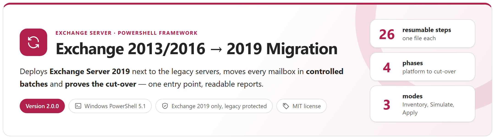
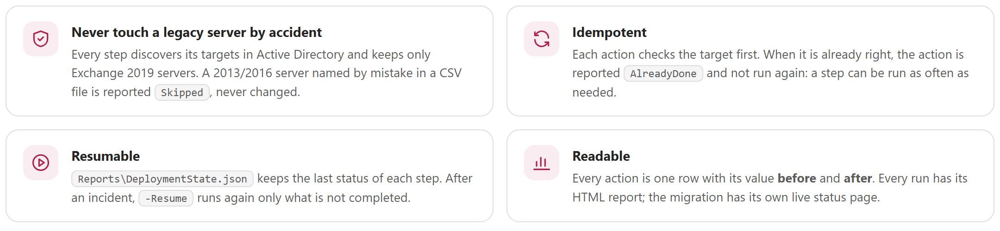
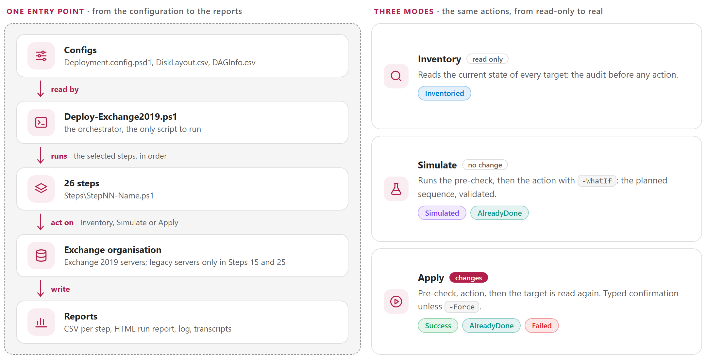
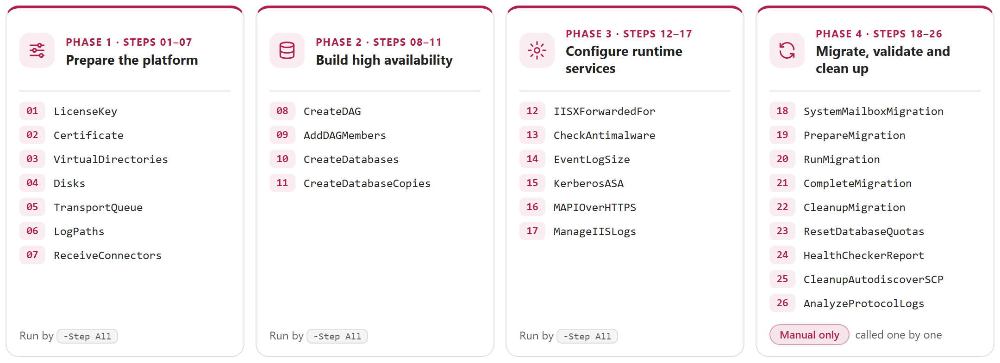
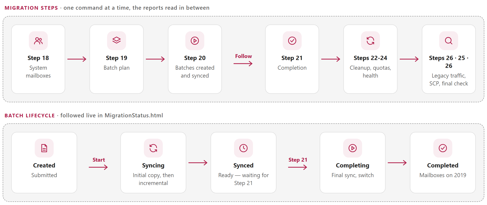
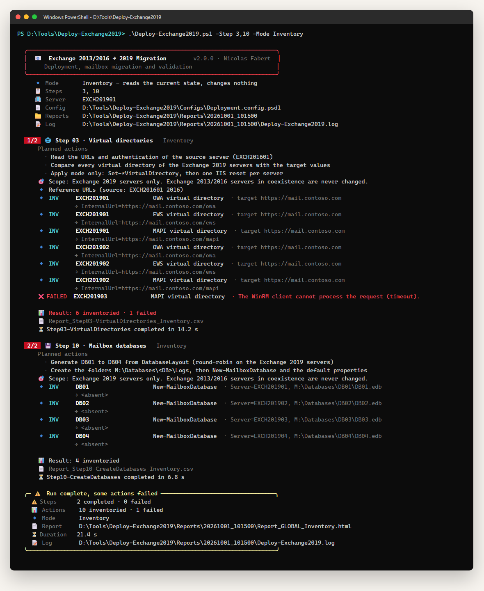
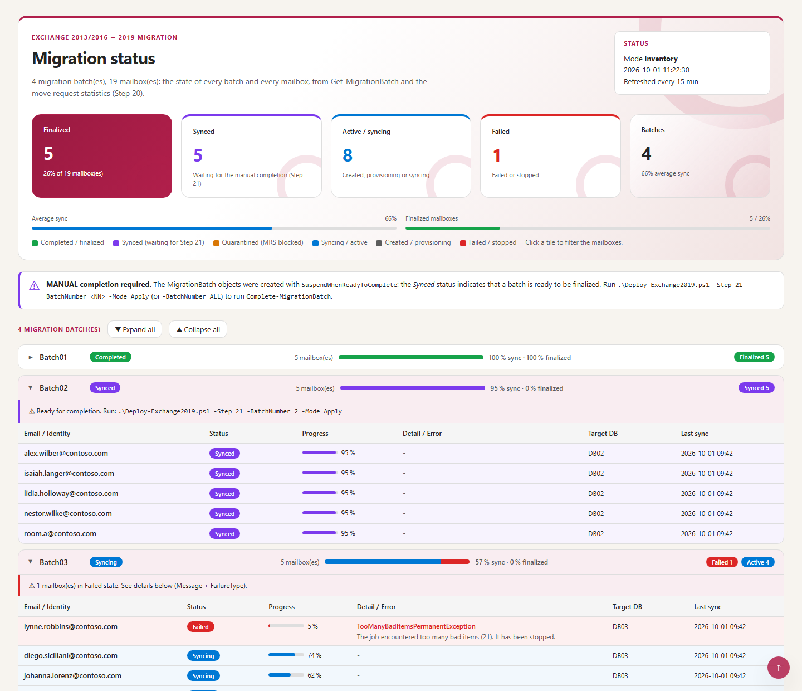
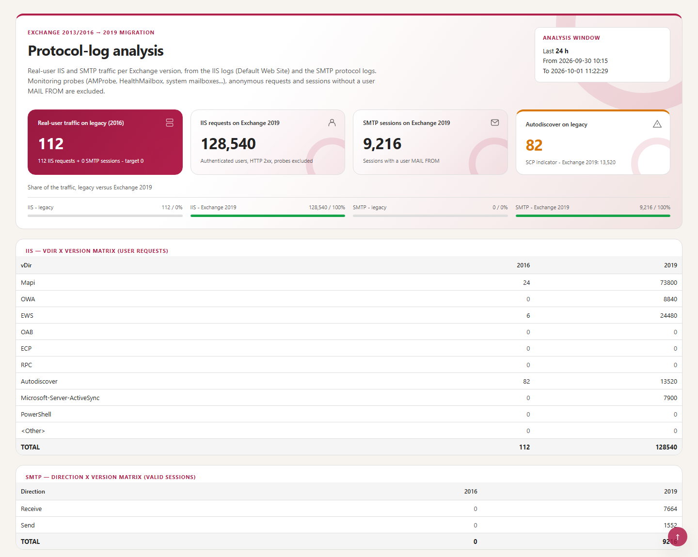

<p align="center">
  <picture>
    <source media="(prefers-color-scheme: dark)" srcset="package/Docs/images/readme-banner-dark.png">
    
  </picture>
</p>

<p align="center">
  <a href="#how-it-works"><b>How it works</b></a> &nbsp;&middot;&nbsp;
  <a href="#the-26-steps"><b>The 26 steps</b></a> &nbsp;&middot;&nbsp;
  <a href="#migration-runbook"><b>Migration runbook</b></a> &nbsp;&middot;&nbsp;
  <a href="#reports"><b>Reports</b></a> &nbsp;&middot;&nbsp;
  <a href="#quick-start"><b>Quick start</b></a> &nbsp;&middot;&nbsp;
  <a href="package/Docs/Exchange2019Migration-Guide.md"><b>Administrator guide</b></a>
</p>

> [!IMPORTANT]
> Files downloaded from the Internet may be blocked by Windows and fail to run. Before using this project, unblock every file in the downloaded folder:
>
> ```powershell
> Get-ChildItem "C:\Chemin\Du\Dossier" -Recurse -File -Force | Unblock-File
> ```
>
> Replace the example path with the folder where you downloaded or extracted this project.

## Why

Moving an organisation from Exchange 2013/2016 to Exchange 2019 means dozens of settings on every new server, a DAG, databases and copies, then weeks of mailbox moves, and finally the proof that no client still uses the old servers. Done by hand, each of these actions is a risk for the servers in production. This framework runs them as **26 numbered steps**, each one able to **read** the current state, **simulate** the change and **apply** it, and it never touches the legacy servers by accident.

<picture>
  <source media="(prefers-color-scheme: dark)" srcset="package/Docs/images/readme-principles-dark.png">
  
</picture>

## How it works

<picture>
  <source media="(prefers-color-scheme: dark)" srcset="package/Docs/images/readme-how-it-works-dark.png">
  
</picture>

Each step is one file, `Steps\StepNN-Name.ps1`, holding one function, `Invoke-Step`. The step discovers its targets, then calls `Invoke-Action` once per **atomic action** (one server, one virtual directory, one database...). `Invoke-Action` decides what to do according to the mode and writes the report row, with the value **before** and **after**.

## The 26 steps

<picture>
  <source media="(prefers-color-scheme: dark)" srcset="package/Docs/images/readme-steps-dark.png">
  
</picture>

- **Steps 01 to 17** build the Exchange 2019 platform: they can run together, `-Step All`, phase by phase.
- **Steps 18 to 26** migrate and validate: they are **manual only**. `-Step All -Mode Apply` never runs them; each one is called by number or by name.
- **Exchange 2019 only**: targets are discovered in Active Directory and filtered on `Version 15.2*`, Edge excluded. Only Steps 15 and 25 touch the legacy servers, and they say so in red.

## Migration runbook

<picture>
  <source media="(prefers-color-scheme: dark)" srcset="package/Docs/images/readme-runbook-dark.png">
  
</picture>

**The proof of the cut-over.** Step 26 reads the IIS and SMTP logs of every server and counts the traffic of **real users** per Exchange version. Everything technical is excluded first: monitoring probes (`AMProbe`, `HealthMailbox`, Managed Availability), system and arbitration mailboxes, IIS pool and built-in accounts, anonymous requests, NTLM challenges, load-balancer checks, and SMTP sessions without a real sender (`<>`, postmaster, system mailboxes). **No legacy traffic left** means the old servers can be decommissioned. The rules are in the configuration and in [Annex B of the guide](package/Docs/Exchange2019Migration-Guide.md#annex-b--protocol-log-filtering-rules).

## Reports

<table>
  <tr>
    <td width="50%" valign="top"><a href="package/Docs/images/console-run.png"></a><br><sub><b>Console</b> &middot; title card, one line per action with its status, summary card</sub></td>
    <td width="50%" valign="top"><a href="package/Docs/images/report-run.png"></a><br><sub><b>Run report</b> &middot; one row per action, before and after, search and status filters</sub></td>
  </tr>
  <tr>
    <td width="50%" valign="top"><a href="package/Docs/images/report-migration-status.png"></a><br><sub><b>Migration status</b> &middot; live follow of the batches and move requests (Steps 20 and 21)</sub></td>
    <td width="50%" valign="top"><a href="package/Docs/images/report-protocol-logs.png"></a><br><sub><b>Protocol-log analysis</b> &middot; real-user IIS and SMTP traffic, legacy versus 2019 (Step 26)</sub></td>
  </tr>
</table>

Every run also writes **one CSV per step**, a global CSV, a run log and one transcript per step in `Reports\<run>\`. All the reports are self-contained HTML files, with a light and a dark theme.
## Requirements

| Item | Requirement |
|---|---|
| Server | Windows Server 2019 or 2022 |
| PowerShell | Windows PowerShell 5.1 — Exchange Management Shell 2019, local or through WinRM |
| Permissions | Exchange *Organization Management*, local administrator on the Exchange 2019 servers, rights on Active Directory for Steps 07 and 15 |
| Network | WinRM (5985) to the Exchange 2019 servers |
| Console | Windows Terminal recommended (emoji and colours); the classic console works too |

## Quick start

```powershell
git clone https://github.com/Nico77600/Exchange2013-2016-to-2019-Migration.git Deploy-Exchange2019
cd Deploy-Exchange2019\package
notepad .\Configs\Deployment.config.psd1                     # URLs, domain, product key, databases...
notepad .\Configs\DiskLayout.csv ; notepad .\Configs\DAGInfo.csv

.\Deploy-Exchange2019.ps1 -Step List                         # the 26 steps
.\Deploy-Exchange2019.ps1 -Step All -Mode Inventory          # current state, changes nothing
.\Deploy-Exchange2019.ps1 -Step 1,2,3 -Mode Simulate         # preview
.\Deploy-Exchange2019.ps1 -Step 1,2,3 -Mode Apply            # apply (asks YES)
.\Deploy-Exchange2019.ps1 -Step 20 -Follow -FollowInterval 15   # follow the migration batches
```

The environment values of the configuration are empty in this repository; `DiskLayout.csv` and `DAGInfo.csv` hold *contoso* examples. The `package` folder holds exactly the files needed to run, with the guide; copying it works too. The zip content built by `.\tools\New-MigrationPackage.ps1` contains the same run-time files with the HTML guide. The `Reports\` folder (run output: server, database and mailbox names) is never committed.

## Documentation

The **administrator guide** covers the background, installation, every configuration key, the 26 steps one by one, the mailbox migration runbook, the reports, the internals, troubleshooting and the protocol-log filtering rules:

- [package/Docs/Exchange2019Migration-Guide.md](package/Docs/Exchange2019Migration-Guide.md)
- `package/Docs/Exchange2019Migration-Guide.html` — the same guide as a single HTML file (download it and open it locally)

## Tests

```powershell
Invoke-Pester -Path .\tests      # Pester 5, no Exchange, no Active Directory
```

## License

[MIT](LICENSE). `Configs\HealthChecker.ps1` is the Microsoft [Exchange HealthChecker](https://github.com/microsoft/CSS-Exchange) script, under its own MIT license.

## Disclaimer

Personal project, provided as is. It is not an official Microsoft product and is not supported by Microsoft. Test it in a lab before production use.
