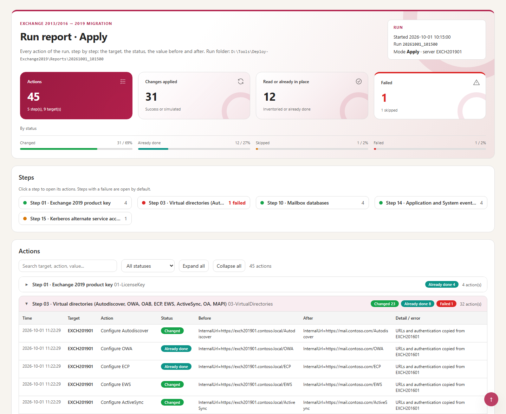

# Exchange 2013/2016 to 2019 Migration

Deploys **Exchange Server 2019** next to an Exchange 2013/2016 organisation, migrates the mailboxes in **controlled batches** and **validates the cut-over** — 26 steps, one PowerShell entry point, readable reports.



## Why

Moving an organisation from Exchange 2013/2016 to Exchange 2019 means dozens of settings on every new server, a DAG, databases and copies, then weeks of mailbox moves, and finally the proof that no client still uses the old servers. Done by hand, each of these actions is a risk for the servers in production. This framework runs them as **26 numbered steps**, each one able to **read** the current state, **simulate** the change and **apply** it — and never touches the legacy servers by accident.

## How it works

```
Configs\  ──►  Deploy-Exchange2019.ps1  ──►  26 steps  ──►  Exchange 2019 servers
(one file per     (one entry point:          (Inventory,       (2013/2016 never changed,
 environment)      modes, resume, reports)    Simulate, Apply)  except steps 15 and 25)
                                                    │
                                                    ▼
                               Reports\<run>\  CSV + HTML + run log
```

| Phase | Steps | Content |
|---|---|---|
| 1 · Prepare the platform | 01–07 | Product key, certificate, virtual directories, disks, transport queue, log paths, receive connectors |
| 2 · Build high availability | 08–11 | IP-less DAG, members, mailbox databases, passive and lagged copies |
| 3 · Configure runtime services | 12–17 | IIS X-Forwarded-For, anti-malware, event logs, Kerberos ASA, MAPI over HTTP, IIS log retention |
| 4 · Migrate, validate, clean up | 18–26 | System mailboxes, migration batches (plan, start, follow, complete), cleanup, quotas, HealthChecker, Autodiscover SCP, protocol-log analysis |

- **Three modes**: `Inventory` reads, `Simulate` runs the changes with `-WhatIf`, `Apply` changes (typed confirmation).
- **Idempotent and resumable**: an action already in place is reported `DONE`; `-Resume` runs again only what is not completed.
- **Exchange 2019 only**: targets are the `Version 15.2*` servers, Edge excluded. Steps 18–26 (migration) never run with `-Step All -Mode Apply`: they are always called explicitly.
- **Proof of the cut-over**: Step 26 counts the **real-user** IIS and SMTP traffic per Exchange version — monitoring probes (`AMProbe`, HealthMailbox, system mailboxes), anonymous requests and system senders are excluded.


## Requirements

| Item | Requirement |
|---|---|
| Server | Windows Server 2019 or 2022 |
| PowerShell | Windows PowerShell 5.1 — Exchange Management Shell 2019, local or through WinRM |
| Permissions | Exchange *Organization Management*, local administrator on the Exchange 2019 servers, rights on Active Directory for Steps 07 and 15 |
| Network | WinRM (5985) to the Exchange 2019 servers |
| Console | Windows Terminal recommended (emoji and colours); the classic console works too |

## Quick start

```powershell
git clone https://github.com/Nico77600/Exchange2013-2016-to-2019-Migration.git Deploy-Exchange2019
cd Deploy-Exchange2019
notepad .\Configs\Deployment.config.psd1                     # URLs, domain, product key, databases...
notepad .\Configs\DiskLayout.csv ; notepad .\Configs\DAGInfo.csv

.\Deploy-Exchange2019.ps1 -Step List                         # the 26 steps
.\Deploy-Exchange2019.ps1 -Step All -Mode Inventory          # current state, changes nothing
.\Deploy-Exchange2019.ps1 -Step 1,2,3 -Mode Simulate         # preview
.\Deploy-Exchange2019.ps1 -Step 1,2,3 -Mode Apply            # apply (asks YES)
.\Deploy-Exchange2019.ps1 -Step 20 -Follow -FollowInterval 15   # follow the migration batches
```

The environment values of the configuration are empty in this repository; `DiskLayout.csv` and `DAGInfo.csv` hold *contoso* examples. The `Reports\` folder (run output: server, database and mailbox names) is never committed.

## Documentation

The **administrator guide** covers the background, installation, every configuration key, the 26 steps one by one, the mailbox migration runbook, the reports, the internals, troubleshooting and the protocol-log filtering rules:

- [Docs/Exchange2019Migration-Guide.md](Docs/Exchange2019Migration-Guide.md)
- `Docs/Exchange2019Migration-Guide.html` — the same guide as a single HTML file (download it and open it locally)

## Tests

```powershell
Invoke-Pester -Path .\tests      # Pester 5, no Exchange, no Active Directory
```

## License

[MIT](LICENSE). `Configs\HealthChecker.ps1` is the Microsoft [Exchange HealthChecker](https://github.com/microsoft/CSS-Exchange) script, under its own MIT license.

## Disclaimer

Personal project, provided as is. It is not an official Microsoft product and is not supported by Microsoft. Test it in a lab before production use.
